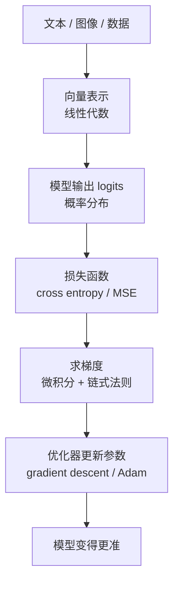

# 00 AI 数学基础：给开发者的够用版

这章不是写给数学专业学生的，而是写给“需要做 AI，但不想一上来被公式劝退”的开发者。目标不是把你训练成数学家，而是让你遇到下面这些表达时不慌：

- `xW + b`
- `q·k`
- `softmax`
- `cross entropy`
- `gradient`
- `cosine similarity`

真正做 AI 工作时，数学的作用更像“读懂模型语言”，而不是考试。

## 1. 为什么做 AI 需要数学

因为模型本质上是函数，训练本质上是优化，数据本质上是不确定分布。

换句话说：

- 线性代数告诉你“张量在怎么流动”
- 概率统计告诉你“模型在不确定性下怎么表达和估计”
- 微积分告诉你“参数怎么更新”
- 优化方法告诉你“训练为什么能收敛，为什么有时又不收敛”

如果把这几块完全绕开，就很难真正理解模型为什么有效、为什么失效。

## 2. 你最先需要掌握的，不是证明，而是对象

做 AI 时最常见的数学对象有四种：

- 标量 `scalar`：一个数，例如损失值 `0.42`
- 向量 `vector`：一串有序数字，例如一个 embedding
- 矩阵 `matrix`：二维数字表，例如线性层权重
- 张量 `tensor`：更高维的数字块，本质上是矩阵的推广

一个简单的心智模型：

- 标量像一个温度计读数
- 向量像一行特征
- 矩阵像一个线性变换器
- 张量像神经网络里的通用数据容器

## 3. 线性代数：AI 里最常用的部分

### 3.1 向量是什么

向量可以理解成“一个对象在多个维度上的数值表示”。例如一个 4 维向量：

`x = [0.1, -0.7, 1.4, 0.2]`

在 AI 里，token、句子、图像 patch、用户行为，都可能被编码成向量。

### 3.2 点积为什么这么重要

两个向量的点积定义为：

`a·b = Σ a_i b_i`

它在 AI 里非常重要，因为它常被用来表示“相似度”或“匹配强度”。

例如：

- 注意力里 `q·k` 表示 query 和 key 的匹配程度
- 检索里 embedding 点积可用于排序候选文档

直觉上：

- 点积大，表示方向更一致、匹配更强
- 点积小甚至为负，表示方向差异更大

### 3.3 范数和长度

向量长度常写成范数：

`||x|| = sqrt(Σ x_i^2)`

它表示向量“有多大”。有时我们关心的不是长度，而是方向，这就引出了 cosine similarity。

### 3.4 余弦相似度

余弦相似度定义为：

`cos(a, b) = (a·b) / (||a|| ||b||)`

它表示两个向量方向的接近程度，不太受长度影响。

在 embedding 检索中，它非常常见，因为我们很多时候更关心“语义方向是否接近”，而不是某个向量是否整体更大。

## 4. 矩阵乘法：神经网络最常见的动作

如果说神经网络有一种“原子操作”，那往往就是矩阵乘法。

最常见的线性层写成：

`y = xW + b`

其中：

- `x` 是输入向量
- `W` 是权重矩阵
- `b` 是偏置
- `y` 是输出向量

它本质上是在做一件事：把输入投影到另一个空间。

### 4.1 为什么矩阵乘法能表达很多事情

因为它可以统一表示：

- 特征加权组合
- 维度升降
- 不同表示空间之间的映射
- Q/K/V 投影

所以你在几乎所有模型结构里都会反复看到矩阵乘法。

## 5. 概率：模型为什么不直接给答案，而给分布

语言模型不是在输出一个“绝对真理”，而是在输出一个概率分布：

`P(token | context)`

也就是：给定上下文，下一个 token 是什么的概率有多大。

这非常重要，因为真实世界有不确定性：

- 同一个问题可以有不同表达
- 同一个句子可以有多种合理续写
- 同一个任务可能有多个都不错的答案

所以模型天生更像“概率预测器”，而不是“符号推理器”。

### 5.1 期望和平均

期望 `expectation` 可以理解成“概率意义上的平均结果”。它在损失函数、优化目标、抽样分析里很常见。

### 5.2 方差

方差告诉你一个随机变量波动有多大。训练里我们经常关心：

- 梯度方差大不大
- 不同 batch 的波动稳不稳
- 估计结果是否过于噪声

## 6. Softmax：从分数到概率

模型先输出 logits，也就是一组未归一化分数。softmax 把它们变成概率：

`softmax(z_i) = exp(z_i) / Σ exp(z_j)`

你可以把它理解成：

- 先把每个分数映射成正数
- 再归一化，让所有概率加起来等于 1

### 6.1 温度 temperature 是什么

如果加上温度 `T`：

`softmax(z_i / T)`

那么：

- `T` 小，分布更尖锐，更保守
- `T` 大，分布更平坦，更发散

这就是推理时 temperature 的数学来源。

## 7. Cross Entropy：为什么训练目标长这样

分类或语言模型训练里，常见损失函数是交叉熵。

直觉上，它在做一件事：

“如果正确答案是 A，那模型就应该把尽可能大的概率分给 A。”

如果模型给正确 token 的概率很低，loss 就很高；给得越高，loss 越低。

在语言模型里，整段文本的训练目标就是不断把正确下一个 token 的概率推高。

## 8. 微积分：训练为什么能更新参数

### 8.1 导数是什么

导数可以理解成：

“当输入变化一点点，输出会变化多少。”

如果函数是 `y = f(x)`，那么导数 `dy/dx` 表示在当前点附近，`x` 的微小变化对 `y` 的影响。

### 8.2 偏导数是什么

神经网络参数很多，不止一个变量，所以我们更常见的是偏导数：

“其他变量先不动，只看某一个变量变化时，loss 怎么变。”

### 8.3 梯度是什么

梯度 `gradient` 是所有偏导数组成的向量。它告诉我们：

- 往哪个方向走，loss 增长最快
- 反过来，往负梯度方向走，loss 往往会下降

## 9. 链式法则：反向传播的数学核心

神经网络是很多层函数叠起来的：

`x -> h1 -> h2 -> h3 -> loss`

链式法则告诉我们：

如果最终 loss 依赖 `h3`，而 `h3` 又依赖 `h2`，`h2` 又依赖 `h1`，那么误差可以一层层传回去。

这就是反向传播的数学基础。

你不需要一开始就能手推所有公式，但一定要抓住直觉：

- 前向传播算结果
- 反向传播算“谁该为错误负责”

## 10. 梯度下降：训练就是在下山

想象 loss 是一片山地，当前参数在山坡上的某个位置。训练的目标就是往更低的地方走。

最基本的更新公式：

`theta = theta - lr * grad`

其中：

- `theta` 是参数
- `lr` 是 learning rate
- `grad` 是梯度

如果学习率太大：

- 可能来回震荡
- 甚至直接发散

如果学习率太小：

- 学得很慢
- 容易卡在不好的位置

## 11. 为什么优化器不只是“普通梯度下降”

实际训练里经常用：

- SGD
- Momentum
- Adam
- AdamW

它们的区别可以先不记公式，先记直觉：

- SGD 像每次只看当前坡度
- Momentum 像带一点惯性
- Adam 像给每个参数单独调步长

这也是为什么“优化器选择 + 学习率调度”会显著影响训练效果。

## 12. 相似度、几何和高维空间直觉

大模型里很多概念最终都落在“向量空间几何”上：

- embedding 相近表示语义相近
- attention 看 `q` 和 `k` 的匹配
- 检索看 query 向量和文档向量是否靠近
- 量化看是否保住方向和内积

所以你可以把很多 AI 技术统一理解为：

“把对象映射到向量空间，再在空间里做几何运算。”

## 13. 这几个数学符号最值得优先认识

| 符号 | 读法 | 你可以先把它理解成什么 |
| --- | --- | --- |
| `Σ` | sigma | 求和 |
| `∈` | belongs to | 属于某个集合 |
| `R^d` | R to the d | d 维实数向量空间 |
| `||x||` | norm | 向量长度 |
| `x^T` | transpose | 转置 |
| `argmax` | arg max | 让值最大的那个输入 |
| `E[x]` | expectation | 期望、平均趋势 |
| `∂L/∂x` | partial derivative | x 对损失的影响 |

## 14. 数学不好，应该先补到什么程度

如果你的目标是做 AI 开发，而不是做理论研究，那么至少建议补到下面这个层级：

- 看懂向量、矩阵、张量的形状
- 看懂点积、cosine similarity 在表达什么
- 看懂 softmax、cross entropy 的直觉
- 看懂梯度、学习率、优化器在干什么
- 看懂 attention 公式的每一部分是什么意思

做到这一步，已经足以读大量工程论文、框架文档和技术博客。

## 15. 一个把数学串起来的总图

## 16. 小结

做 AI 最需要的数学，不是复杂证明，而是四种直觉：

- 向量空间直觉
- 概率分布直觉
- 梯度更新直觉
- 优化过程直觉

把这四个抓住，后面你看到的很多模型公式，都会从“天书”变成“可解释的工程语言”。

## 17. 学以致用

读完这一章后，你不必急着推导复杂公式，但可以马上做三件小事：

1. 手算一个 3 维向量的点积和 cosine similarity
2. 手算一个三分类 softmax 和 cross entropy
3. 回头再看一次 [04-transformer.md](./04-transformer.md) 里的 `q·k` 和 `softmax`

如果你能把这三件事做出来，这章的目标就已经达到了。

## 18. 继续往下读

这章解决的是“看懂 AI 数学语言”的问题。下一步最适合读的是：

- [03-neural-networks.md](./03-neural-networks.md)：把这些数学对象放进可训练模型里
- [04-transformer.md](./04-transformer.md)：看这些数学语言如何变成现代大模型的核心结构

## 参考阅读

- 3Blue1Brown, *Essence of Linear Algebra*
- 3Blue1Brown, *Essence of Calculus*
- Dive into Deep Learning, math appendix
