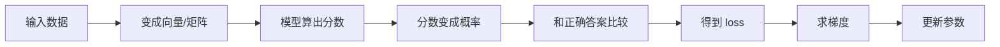
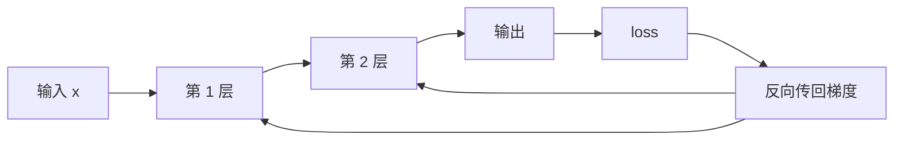
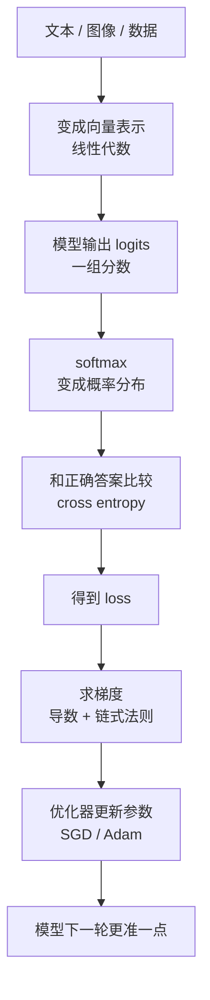

# 00 AI 数学基础：给零基础开发者的够用版

这章不是写给数学专业学生的，而是写给下面这类读者：

- 想学大模型，但一看到公式就容易断线
- 做过开发，对变量、函数、数组不陌生
- 不想先花几个月补高数和线代，想先把 AI 里最常用的部分学会

这章的目标不是把你训练成数学家，而是让你看到下面这些表达时不慌：

- `xW + b`
- `q·k`
- `softmax`
- `cross entropy`
- `gradient`
- `cosine similarity`

真正做 AI 时，数学更像“模型的工作语言”，而不是考试题。

## 1. 这章怎么读，才不会被公式劝退

如果你是零基础，建议按下面这个顺序读：

1. 先看每一节最前面的直觉解释
2. 再看后面的最小公式
3. 最后看“它在大模型里到底用来干什么”

你不需要一上来推导证明，只需要先搞懂三件事：

- 这个公式里的对象是什么
- 这些对象怎么流动、怎么变化
- 它为什么会出现在模型训练或推理里

如果你能做到这一步，后面读 Transformer、训练、RAG、推理优化时，难度会明显下降。

## 2. 为什么做 AI 需要数学

因为模型本质上是函数，训练本质上是优化，输出本质上是概率分布。

换句话说：

- 线性代数告诉你“数字表示是怎么流动的”
- 概率统计告诉你“模型为什么输出分布而不是绝对答案”
- 微积分告诉你“参数为什么能被更新”
- 优化方法告诉你“为什么有时能学会，有时却学崩了”

可以把它想成一条流水线：

你学数学，不是为了炫技，而是为了看懂这条流水线每一步在干什么。

## 3. 遇到公式时，先别急着算，先看这 4 件事

很多初学者看到公式会本能地想：“这怎么推出来的？”  
更适合入门的问法其实是：

1. 这几个字母分别代表什么对象
2. 它们的形状是什么
3. 这个操作是在“比较”“加权”“归一化”还是“更新”
4. 这个结果会被后面哪一步拿去用

例如看到：

`y = xW + b`

先不要怕，先翻译成人话：

- `x` 是输入
- `W` 是要学出来的权重
- `b` 是一个额外可调的偏移量
- `xW` 表示把输入做一次线性变换
- 最后得到 `y`

也就是说，这不是一串“陌生符号”，而是在说：

“把输入乘上一个可学习的变换器，再加一个偏移，得到输出。”

## 4. 先认识 4 种最常见的数学对象

做 AI 时，最常见的是这四种对象：

| 对象 | 英文 | 你可以先把它理解成什么 | 例子 |
| --- | --- | --- | --- |
| 标量 | `scalar` | 一个数 | loss=`0.42` |
| 向量 | `vector` | 一串有顺序的数 | 一个 token 的 embedding |
| 矩阵 | `matrix` | 二维数字表 | 线性层权重 |
| 张量 | `tensor` | 更高维的数字块 | 一个 batch 的隐藏状态 |

一个更容易记的心智模型：

- 标量像温度计上的一个读数
- 向量像“一个对象的多维特征”
- 矩阵像“一个负责变换输入的机器”
- 张量像“神经网络里的通用数据容器”

### 4.1 在大模型里，它们分别长什么样

下面这几个例子最常见：

- 一个 token 的 embedding：一个向量
- 一句话里所有 token 的 embedding：一个矩阵
- 一个 batch 的所有句子表示：一个张量
- 训练时的 loss：一个标量

比如：

- 单个 token 表示：`[0.2, -0.7, 1.1, 0.4]`
- 一句话有 3 个 token，每个 token 4 维：形状可以看成 `3 x 4`
- 一个 batch 有 8 句话，每句话 128 个 token，每个 token 768 维：形状可以看成 `8 x 128 x 768`

你会发现，很多看起来复杂的模型，本质上只是这些对象在不停变形、相乘、加权、更新。

## 5. 线性代数：AI 里最常见的部分

### 5.1 向量是什么

向量可以理解成：

“一个对象在多个维度上的数值表示。”

例如一个 4 维向量：

`x = [0.1, -0.7, 1.4, 0.2]`

在 AI 里，下面这些东西都可能被表示成向量：

- 一个 token
- 一个句子
- 一张图片切出来的 patch
- 一个用户的行为画像

向量不一定每一维都有直观含义。  
很多维度不是“第 1 维代表情感，第 2 维代表颜色”这种人工定义，而是模型训练后自己形成的表示空间。

### 5.2 点积为什么这么重要

两个向量的点积定义为：

`a·b = Σ a_i b_i`

如果你第一次看到这个公式，可以把它理解成：

“把两个向量对应位置相乘，再全部加起来，得到一个匹配分数。”

看一个最小例子：

`a = [1, 2, 3]`

`b = [4, 5, 6]`

那么：

`a·b = 1*4 + 2*5 + 3*6 = 4 + 10 + 18 = 32`

这个数越大，通常说明两个向量方向越接近、匹配越强。

在大模型里，它的重要性非常高：

- 注意力里 `q·k` 表示 query 和 key 的匹配程度
- 检索里 query embedding 和文档 embedding 的点积可用于排序
- 推荐系统里用户向量和商品向量也常这样算相关性

### 5.3 范数和“长度”

向量长度常写成：

`||x|| = sqrt(Σ x_i^2)`

你可以先把它理解成：

“这个向量整体有多大。”

例如：

`x = [3, 4]`

那么：

`||x|| = sqrt(3^2 + 4^2) = sqrt(9 + 16) = 5`

这个长度不是 AI 独有概念，但在 embedding、相似度、归一化里都很常见。

### 5.4 余弦相似度：比长度更关心方向

余弦相似度定义为：

`cos(a, b) = (a·b) / (||a|| ||b||)`

它的作用是：

“比较两个向量方向像不像，而不是只看数值大小。”

看一个很直观的例子：

`a = [1, 1]`

`b = [2, 2]`

虽然 `b` 比 `a` 大一倍，但它们方向完全一样，所以余弦相似度会非常接近 `1`。

这在 embedding 检索里很常见，因为我们很多时候更关心：

- 语义是否接近
- 表达方向是否一致

而不是某个向量整体数值更大。

### 5.5 矩阵乘法：神经网络最常见的动作

如果说神经网络有一种“原子操作”，那通常就是矩阵乘法。

最常见的线性层写成：

`y = xW + b`

其中：

- `x` 是输入向量
- `W` 是权重矩阵
- `b` 是偏置
- `y` 是输出向量

如果你不熟矩阵乘法，先记住它在 AI 里的直觉：

“把输入做一次可学习的线性变换，投影到另一个空间里。”

### 5.6 一个能手算的线性层例子

假设：

`x = [2, 3]`

`W = [[1, 4], [2, 5]]`

`b = [1, 1]`

那么：

`xW = [2*1 + 3*2, 2*4 + 3*5] = [8, 23]`

再加上偏置：

`y = [8, 23] + [1, 1] = [9, 24]`

这就是一层线性层在干的事。

在大模型里，下面这些地方本质上都是这个套路：

- embedding 后的投影
- attention 里的 `Q/K/V` 投影
- MLP 里的线性层
- 输出 logits 前的线性映射

### 5.7 看公式时，shape 往往比数值更重要

在工程里，很多 bug 不是“公式错了”，而是“形状不对”。

看到一个矩阵公式时，先检查：

- 输入是几维
- 输出要变成几维
- 中间相乘时维度能不能对上

例如：

- `x` 形状是 `1 x 3`
- `W` 形状是 `3 x 2`
- 那么 `xW` 结果就是 `1 x 2`

如果维度对不上，公式再漂亮也跑不起来。

## 6. 概率：模型为什么给的是分布，不是绝对答案

语言模型不是在输出“绝对真理”，而是在输出：

`P(token | context)`

也就是：

“给定上下文，下一个 token 是某个候选词的概率有多大。”

这很重要，因为真实世界本来就有不确定性：

- 同一个问题可以有不同表达
- 同一句话可以有多种合理续写
- 同一个任务可能有多个都不错的答案

所以模型天然更像“概率预测器”，而不是“死板规则机”。

### 6.1 logits 是什么

模型通常不会直接先给你概率，而是先给一组分数，叫 `logits`。

例如一个三分类任务，模型输出：

`z = [2.0, 1.0, 0.1]`

这三个数可以先理解成：

- 第 1 类的倾向分数是 2.0
- 第 2 类的倾向分数是 1.0
- 第 3 类的倾向分数是 0.1

但它们还不是概率，因为：

- 可能有负数
- 不一定加起来等于 1
- 不方便直接解释为“概率”

所以接下来会用 `softmax`。

### 6.2 Softmax：把分数变成概率

softmax 的定义是：

`softmax(z_i) = exp(z_i) / Σ exp(z_j)`

你可以先把它理解成两步：

1. 把每个分数变成正数
2. 再归一化，让所有结果加起来等于 1

看上面的例子：

`z = [2.0, 1.0, 0.1]`

指数后大约变成：

- `exp(2.0) ≈ 7.39`
- `exp(1.0) ≈ 2.72`
- `exp(0.1) ≈ 1.11`

总和约为：

`7.39 + 2.72 + 1.11 = 11.22`

于是概率大约是：

- 第 1 类：`7.39 / 11.22 ≈ 0.66`
- 第 2 类：`2.72 / 11.22 ≈ 0.24`
- 第 3 类：`1.11 / 11.22 ≈ 0.10`

这时你就能读懂：

“模型认为第 1 类最可能，概率大约 66%。”

### 6.3 temperature 是什么

如果 softmax 前再除一个温度 `T`：

`softmax(z_i / T)`

那么：

- `T` 小，分布更尖锐，模型更保守
- `T` 大，分布更平坦，模型更发散

直觉上就是：

- 低温：更愿意押注最可能答案
- 高温：更愿意把概率分给更多候选

这就是推理参数 `temperature` 的数学来源。

### 6.4 交叉熵为什么长这样

训练分类模型或语言模型时，常见损失函数是 `cross entropy`。

入门时不用先背完整公式，先记住直觉：

“如果正确答案是 A，那模型就应该把尽可能大的概率分给 A。”

例如，正确类别是第 1 类：

- 如果模型给第 1 类概率 `0.90`，说明答得比较准，loss 会比较低
- 如果模型只给第 1 类概率 `0.10`，说明答得很差，loss 会很高

交叉熵本质上就是在惩罚：

“你为什么没有把高概率给正确答案？”

### 6.5 一个能手算的交叉熵直觉例子

如果正确答案的概率是 `p`，那么负对数损失可写成：

`loss = -log(p)`

你不需要现在深究为什么是对数，先看现象：

- `p = 0.9` 时，loss 很小
- `p = 0.5` 时，loss 变大
- `p = 0.1` 时，loss 很大

也就是说：

“模型越不相信正确答案，惩罚越重。”

这就是语言模型训练目标的核心直觉。

## 7. 微积分：训练为什么能更新参数

### 7.1 导数是什么

导数可以理解成：

“当输入轻微变化时，输出会跟着变化多少。”

如果函数是：

`y = f(x)`

那么导数 `dy/dx` 表示在当前点附近，`x` 的微小变化对 `y` 的影响。

如果你觉得这句话抽象，可以想象你在爬山：

- 地面很陡，说明再往前走一点，高度会变很多
- 地面很平，说明再往前走一点，高度变化不大

导数就像“当前坡度”。

### 7.2 偏导数是什么

神经网络参数非常多，不止一个变量，所以更常见的是偏导数。

它表示：

“先把其他变量固定，只看某一个变量变化时，loss 怎么变。”

例如一个函数依赖两个参数 `w1` 和 `w2`：

`L = f(w1, w2)`

那么：

- `∂L/∂w1` 表示 `w1` 对 loss 的影响
- `∂L/∂w2` 表示 `w2` 对 loss 的影响

### 7.3 梯度是什么

梯度 `gradient` 可以理解成：

“所有偏导数组成的方向提示器。”

它告诉我们：

- 往哪个方向走，loss 增长最快
- 反过来，往负梯度方向走，loss 往往会下降

所以训练时你会经常看到：

`theta = theta - lr * grad`

这句话不是魔法，而是在说：

“参数往让 loss 下降的方向挪一小步。”

### 7.4 链式法则：反向传播为什么成立

神经网络不是一个简单函数，而是很多层函数套起来：

`x -> h1 -> h2 -> h3 -> loss`

链式法则告诉我们：

如果最终的 loss 依赖 `h3`，`h3` 依赖 `h2`，`h2` 依赖 `h1`，那误差就可以一层层传回去。

初学者只要抓住这个直觉就够了：

- 前向传播：算结果
- 反向传播：算“谁该为错误负责”

### 7.5 梯度下降：训练就是在下山

想象 loss 是一片山地，当前参数在山坡上的某个位置。  
训练的目标，就是往更低的地方走。

最基本的更新公式：

`theta = theta - lr * grad`

其中：

- `theta` 是参数
- `lr` 是学习率
- `grad` 是梯度

看一个最小数值例子：

- 当前参数：`theta = 3.0`
- 当前梯度：`grad = 2.0`
- 学习率：`lr = 0.1`

更新后：

`theta = 3.0 - 0.1 * 2.0 = 2.8`

也就是说，参数从 `3.0` 往让 loss 下降的方向移动了一小步。

### 7.6 学习率为什么很关键

如果学习率太大：

- 可能来回震荡
- 可能直接越过低点
- 甚至训练发散

如果学习率太小：

- 学得很慢
- 可能长时间没效果
- 容易卡在不好的位置附近

所以很多训练问题，最后都不是“模型原理错了”，而是“优化设置没调好”。

### 7.7 为什么优化器不只是普通梯度下降

实际训练里经常用：

- SGD
- Momentum
- Adam
- AdamW

你可以先记直觉，不必先记公式：

- SGD：像每次只看眼前坡度
- Momentum：像带一点惯性，不容易被小抖动影响
- Adam：像给每个参数单独调步长，常更省心
- AdamW：在 Adam 基础上把权重衰减处理得更清楚

这也是为什么“优化器选择 + 学习率调度”会显著影响训练结果。

## 8. 大模型为什么特别依赖“高维空间直觉”

大模型里很多概念最后都会落到“向量空间几何”上：

- embedding 相近，往往表示语义相近
- attention 看 `q` 和 `k` 的匹配强度
- 检索看 query 向量和文档向量是否靠近
- 量化也会关心方向和内积是否被保住

所以你可以把很多 AI 技术统一理解为：

“先把对象映射到向量空间，再在空间里做几何运算。”

这也是为什么线性代数看起来像基础课，但它其实一直活在大模型内部。

## 9. 把一条最关键的公式拆开看

很多人第一次看到 attention 公式会直接懵：

`Attention(Q, K, V) = softmax(QK^T / sqrt(d_k)) V`

其实可以把它拆成 4 步：

1. `QK^T`：先算每个位置和其他位置的匹配分数
2. `/ sqrt(d_k)`：把分数缩放到更稳定的范围
3. `softmax(...)`：把分数变成权重分布
4. `... V`：用这些权重对 value 做加权求和

你可以把它理解成：

“当前位置先看看自己应该关注谁，再把那些位置的信息按权重读回来。”

对应关系如下：

| 公式部分 | 先把它理解成什么 |
| --- | --- |
| `Q` | 当前问题在问什么 |
| `K` | 每个位置可被匹配的索引 |
| `V` | 每个位置真正携带的信息 |
| `QK^T` | 匹配强度表 |
| `softmax` | 把匹配强度变成注意力权重 |
| `...V` | 按权重把信息聚合回来 |

如果你先把这层意思读出来，再去看 [04-transformer.md](./04-transformer.md)，就不会只剩一串符号。

## 10. 这几个数学符号最值得优先认识

| 符号 | 读法 | 你可以先把它理解成什么 |
| --- | --- | --- |
| `Σ` | sigma | 把很多项加起来 |
| `∈` | belongs to | 属于某个集合 |
| `R^d` | R to the d | d 维实数向量空间 |
| `||x||` | norm | 向量长度 |
| `x^T` | transpose | 转置 |
| `argmax` | arg max | 让值最大的那个输入 |
| `E[x]` | expectation | 期望、平均趋势 |
| `∂L/∂x` | partial derivative | x 对损失的影响 |

你不需要一天之内把所有符号全背下来，但这些符号会高频出现，早点眼熟会轻松很多。

## 11. 数学基础薄弱，至少要补到什么程度

如果你的目标是做 AI 开发，而不是做理论研究，那么至少建议补到下面这个层级：

- 看懂向量、矩阵、张量的形状
- 看懂点积和 cosine similarity 在表达什么
- 看懂 `y = xW + b` 是在做什么变换
- 看懂 logits、softmax、cross entropy 的直觉
- 看懂梯度、学习率、优化器在干什么
- 看懂 attention 公式每一部分分别扮演什么角色

做到这一步，已经足以读大量工程论文、框架文档和技术博客。

## 12. 给零基础读者的 3 个手算练习

如果你想确认自己是不是真的理解了，而不是“好像听懂了”，建议立刻手算下面 3 件事。

### 12.1 练习 1：手算点积

给定：

`a = [1, 3, 2]`

`b = [2, 1, 4]`

算出：

`a·b = 1*2 + 3*1 + 2*4 = 13`

如果你能独立算出来，说明你已经理解了“匹配分数”这个概念。

### 12.2 练习 2：手算一个 softmax

给定 logits：

`z = [2, 0]`

你不必特别精确，只要知道：

- `exp(2)` 比 `exp(0)` 大很多
- 所以前者概率会明显更高

如果你能说清楚“为什么第 1 类更大，而且加起来会等于 1”，就够了。

### 12.3 练习 3：手算一步参数更新

给定：

- `theta = 5`
- `grad = 3`
- `lr = 0.1`

那么更新后：

`theta = 5 - 0.1 * 3 = 4.7`

如果这一步能顺畅写出来，说明你已经理解了训练最核心的动作。

## 13. 一个把数学串起来的总图

## 14. 小结

做 AI 最需要的数学，不是复杂证明，而是 4 种直觉：

- 向量空间直觉
- 概率分布直觉
- 梯度更新直觉
- 优化过程直觉

把这四个抓住，后面你再看到很多模型公式，就会从“像天书”变成“能翻译成人话的工程语言”。

## 15. 读完这一章后，最适合接着看什么

这章解决的是“看懂 AI 数学语言”的问题。下一步最适合读的是：

- [03-neural-networks.md](./03-neural-networks.md)：把这些数学对象放进可训练模型里
- [04-transformer.md](./04-transformer.md)：看这些数学语言如何变成现代大模型的核心结构

如果你读 `04` 时再看到：

- `q·k`
- `softmax`
- `QK^T`
- `gradient`

你就能知道它们不是突然出现的新东西，而是这章内容在真实模型中的组合。

## 参考阅读

- 3Blue1Brown, *Essence of Linear Algebra*
- 3Blue1Brown, *Essence of Calculus*
- Dive into Deep Learning, math appendix
