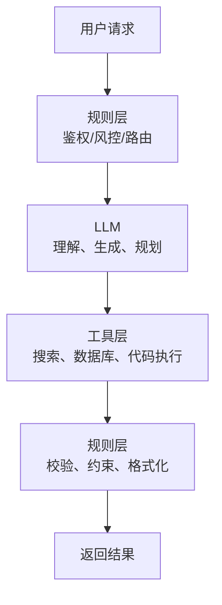

# 02 规则引擎与符号系统

在神经网络成为主流之前，NLP 很大程度上依赖规则、词典、模板和结构化知识。即使在今天的大模型系统里，规则引擎仍然没有消失，而是从“理解核心”退到了“边界控制”和“流程编排”层。

## 1. 什么是规则引擎

规则引擎的核心是把业务知识写成显式条件：

- `if 条件成立 -> 执行动作`
- `if 文本命中模板 A -> 归类为意图 B`
- `if 命中敏感词 -> 拒答或升级审核`

在工程上，它通常由三部分组成：

- 事实集合：当前输入、上下文、状态
- 规则集合：条件判断和动作定义
- 推理机制：前向链推理或后向链推理

## 2. 规则系统在 NLP 里的典型形态

### 2.1 词典与模式匹配

例如：

- 分词词典
- 实体词库
- 敏感词列表
- 正则表达式

它们对格式明确、分布稳定的任务特别有效。

### 2.2 模板系统

早期问答和客服机器人常写成：

- 用户说“查余额” -> 走余额查询流程
- 用户说“重置密码” -> 返回固定操作步骤

这类系统速度快、可控，但一旦用户表达方式稍有变化，就容易失效。

### 2.3 句法与语义规则

有些系统会显式构建：

- 词性标注规则
- 依存句法规则
- 语义槽位填充规则
- 知识图谱查询规则

这种方法强调可解释性，但维护成本高。

## 3. 为什么规则方法曾经很强

因为它非常适合“边界清楚”的场景：

- 业务流程稳定
- 输入格式受控
- 错误成本高，必须可解释
- 数据不足，难以训练大模型

例如编译器、协议解析器、审批流、支付风控、权限判断，本质上仍然大量依赖规则。

## 4. 为什么规则方法后来不够了

自然语言与规则世界最大的冲突在于：语言是连续的、模糊的、可变形的。

同一个意思可以有无穷多表达：

- “帮我看下余额”
- “我卡里还有多少钱”
- “查询账户余额”
- “还有多少可用金额”

如果完全靠模板，你必须不停补规则。随着场景增加，会出现：

- 规则膨胀
- 规则冲突
- 优先级混乱
- 长尾表达覆盖不全

这就是为什么统计学习和神经网络逐渐取代符号系统成为语言理解主力。

## 5. 从符号主义到统计学习

过渡阶段并不是一步跳到深度学习，中间经历了大量统计方法，例如：

- `n-gram` 语言模型
- `Naive Bayes`
- `SVM`
- `HMM`
- `CRF`

这些方法开始依赖数据学习参数，但仍需要大量手工特征，例如：

- 当前词是否在词典中
- 前后 3 个词是什么
- 是否全大写
- 是否以数字结尾

## 6. 神经网络为什么赢

神经网络不是“把规则写得更多”，而是学习一种连续表示空间，让相似表达在向量空间里彼此接近。

例如，“余额”“可用金额”“账户还剩多少钱”虽然字面不同，但在嵌入空间里可能接近，因此模型可以泛化到没见过的句式。

这带来了两个巨大变化：

- 从显式规则匹配，变成隐式模式学习
- 从局部模板覆盖，变成分布式表示泛化

## 7. 规则系统在 LLM 时代的位置

规则并没有过时，而是位置发生了变化。

### 7.1 在模型前

- 输入清洗
- 黑白名单过滤
- 路由到不同模型或工具
- PII 脱敏

### 7.2 在模型后

- 输出格式校验
- JSON schema 验证
- 安全审查
- 结果重排序

### 7.3 在模型外

- Agent 工作流编排
- 工具权限管理
- 多轮状态机
- 审批与回退逻辑

## 8. 规则引擎在工程上是如何工作的

如果把规则引擎说得更技术一点，它并不只是“很多 if-else”，而是一套对事实和规则进行匹配与执行的运行时系统。

典型组件包括：

- `working memory`：当前输入、上下文状态、业务事实
- `rule base`：规则集合
- `agenda`：待触发规则队列
- `inference engine`：根据匹配结果决定触发顺序

工业界规则机常见的是前向链推理：

1. 把事实放入工作内存
2. 找出所有被满足的规则
3. 选择优先级最高的规则执行
4. 规则执行后可能写入新事实
5. 重复直到没有规则可触发

这种结构的优点是强可控、强解释；缺点是状态空间一大就会迅速复杂化。

## 9. RETE 思想：为什么规则机不等于暴力匹配

如果每次来了新输入，都把所有规则从头匹配一遍，复杂度会非常高。经典规则引擎常借助 `RETE` 一类算法，把规则条件编译成共享网络：

- 重复的条件子表达式只匹配一次
- 局部匹配结果可以缓存
- 新事实到来时只增量更新受影响分支

直觉上，RETE 像是在规则集合上建一个“共享索引图”，避免重复工作。

这件事很重要，因为它说明规则系统在自己擅长的问题上，其实也非常讲究编译与执行效率，而不只是“手写业务逻辑”。

## 10. 规则系统失败时，通常是怎么失败的

规则系统的失败模式和神经网络完全不同：

- 它不会“似是而非地猜一个大概对的答案”
- 它更常见的是完全命不中、命中错误模板或规则冲突

典型故障包括：

- 新表达方式没有被覆盖
- 规则优先级配置不合理
- 多条规则同时命中，但动作互相冲突
- 上游清洗逻辑变化，导致规则假设失效

这类错误往往可定位，但修起来会不断引入更多新规则，最终造成维护成本上升。

## 11. 规则系统与神经网络的错误哲学差异

可以把两者的差异理解为：

- 规则系统追求精确匹配，错误往往是“没有覆盖”
- 神经网络追求分布泛化，错误往往是“泛化过头”

因此：

- 规则系统容易漏
- 神经网络容易猜

生产系统设计的重点，就是把“漏”和“猜”的风险分别放在合适的位置上。

## 12. 规则引擎与 LLM 的正确关系

一个成熟系统通常不是“规则 or 模型”，而是“规则 + 模型”。

常见结构如下：

这张图反映了一个重要现实：LLM 擅长模糊理解和生成，但真正的生产系统通常仍需规则提供确定性边界。

## 13. 约束生成其实也是一种“新规则系统”

在 LLM 时代，很多工程团队又重新发明了规则，只是形式不同了：

- JSON schema constrained decoding
- function calling 参数校验
- SQL/代码 AST 约束
- 审计规则与拒答策略

这些技术的共性是：让模型在开放生成前后，都受到某种结构化约束。

所以，现代“规则系统”不一定长得像老式专家系统，它也可能表现为：

- 一个 grammar
- 一个 schema
- 一个验证器
- 一个多阶段判定流水线

## 14. 什么时候应该优先用规则，而不是模型

- 输入空间很小，需求稳定
- 容错率极低，必须完全可解释
- 任务不是理解，而是执行确定流程
- 数据太少，不值得训练或调模型
- 性能要求极高，必须毫秒级稳定响应

例如：

- 订单状态流转
- 权限和风控校验
- API 参数校验
- 代码或配置文件语法检查

## 15. 什么时候应该优先让模型处理

- 用户表达高度自由
- 长尾情况多，规则覆盖困难
- 需要跨句理解、语义归纳或总结
- 输入不是固定表单，而是开放文本

例如：

- 开放问答
- 文档摘要
- 代码解释
- 自然语言到 SQL 初稿生成

## 16. 一个实用判断框架

可以用三句话判断某个子问题该放在哪里：

- 如果你能把正确答案写成确定程序，优先规则
- 如果你写不完规则，但人一看就懂，优先模型
- 如果模型做错代价太高，就让规则做最终裁决

## 17. 小结

规则引擎代表的是“显式知识”，神经网络代表的是“从数据中学习的隐式知识”。现代大模型系统的最佳实践不是让其中一方消失，而是让规则负责确定性边界，让模型负责语义理解、生成和泛化，而约束解码、schema 校验、工具权限这些机制，则是两种思想在今天的重新汇合。
