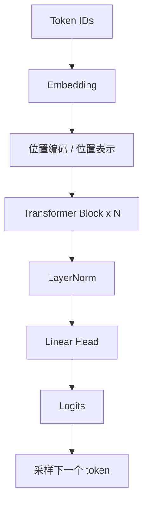
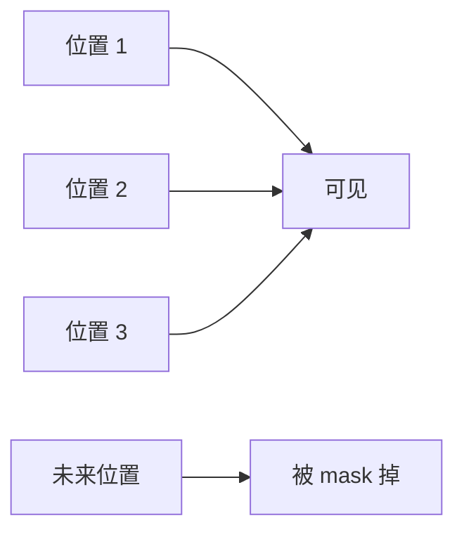
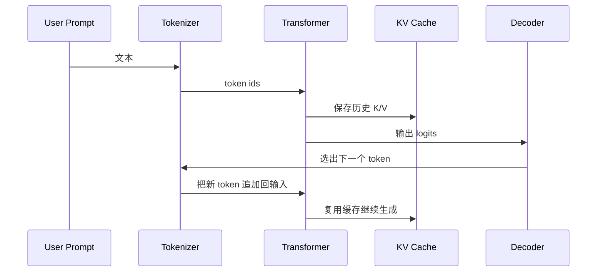

# 04 Transformer 架构

Transformer 是现代大模型的核心架构。理解它，不只是记住 `Q/K/V`，而是要看清楚它如何在并行计算、长程依赖、表示学习和工程扩展性之间取得平衡。

## 1. Transformer 解决了什么问题

RNN/LSTM 的主要限制有两类：

- 处理长依赖困难
- 训练时必须按时间步串行，难以充分并行

Transformer 的关键突破是：让每个位置都能直接访问其他位置，而不是靠隐藏状态一级一级传递信息。

## 2. 整体结构

在大语言模型里，最常见的是 `decoder-only Transformer`。它的生成流程是单向的，只能看当前位置之前的 token。



一个 Transformer block 通常包括：

- 多头自注意力
- 残差连接
- 归一化
- 前馈网络 MLP

## 3. Attention 的直觉

假设句子是：

`The animal didn't cross the street because it was too tired.`

当模型处理 `it` 时，需要判断 `it` 指的是 `animal` 还是 `street`。这需要它直接比较当前词与前文多个词的关联强度。

Attention 的核心思想是：

“当前位置不必只依赖最近邻，而是可以对整个上下文做加权读取。”

## 4. Q、K、V 是什么：从矩阵形状开始看

假设一个 batch 中有一段长度为 `n` 的序列，每个 token 的隐藏维度为 `d_model`。经过线性投影后会得到：

- `Q = XW_Q`
- `K = XW_K`
- `V = XW_V`

其中：

- `X ∈ R^(n x d_model)`
- `W_Q, W_K ∈ R^(d_model x d_k)`
- `W_V ∈ R^(d_model x d_v)`

于是：

- `Q ∈ R^(n x d_k)`
- `K ∈ R^(n x d_k)`
- `V ∈ R^(n x d_v)`

真正的自注意力写成矩阵形式就是：

`Attention(Q, K, V) = softmax(QK^T / sqrt(d_k)) V`

这里的 `QK^T` 形状是 `n x n`，它表示“序列中每个位置，对所有位置的关注强度”。

这一步非常关键，因为它把“语言理解”转化成了一个可并行的相似度计算问题。

## 5. Attention 的另一种理解：可微分的内容寻址

把注意力看成一个“可微分的数据库读取器”会很直观：

- `K` 像索引
- `V` 像存储内容
- `Q` 像查询请求

模型在做的事不是顺着时间一格格回忆，而是在每个时间步都发起一次内容检索：

“当前这个位置，应该从历史上下文的哪些位置读取多少信息？”

这也是为什么很多人把 attention 看作一种 `content-based addressing` 或“软检索”机制。

## 6. 为什么要除以 `sqrt(d_k)`

如果 `Q` 和 `K` 的每个分量都具有近似单位方差，那么 `q·k` 的方差会随维度 `d_k` 增长。维度一大，点积值会变大，softmax 输出就会过于尖锐。

后果是：

- 梯度变小
- 训练不稳定
- 模型过早进入极端选择状态

除以 `sqrt(d_k)` 可以把数值范围拉回更稳定的区间。这是一个看似简单、但极其关键的尺度校正。

## 7. Causal Mask：为什么语言模型不能偷看未来

语言模型训练时，目标是预测下一个 token。如果当前位置能看到未来 token，就等于作弊。

因此 decoder-only Transformer 会加上上三角 mask，使得位置 `t` 只能看 `<= t` 的 token。



在实现上，这通常不是“删除未来列”，而是在 `QK^T` 上把未来位置加上一个极小值偏置，例如 `-inf`，让 softmax 后概率几乎为零。

## 8. Multi-Head Attention：为什么不只做一次 attention

一个 head 只能在一个投影子空间里学习关系模式。多头注意力让模型在不同投影空间里并行学习不同类型的相关性。

如果有 `h` 个头，那么通常：

- 每个头处理较小的 `d_k`
- 多个头的输出再拼接回 `d_model`

不同 head 往往会学到不同结构，例如：

- 指代关系
- 句法依赖
- 局部邻近模式
- 长距离主题一致性

从工程角度看，多头机制是一种“分而治之”的表示策略。

## 9. MQA 和 GQA：大模型为什么开始减少 KV 头数

经典多头注意力为每个 query head 都保留独立的 K/V 头，这在长上下文推理时会让 KV Cache 很大。

后来出现：

- `MQA`：多个 query 头共享一组 K/V
- `GQA`：多个 query 头按组共享 K/V

这类改动的目的很明确：

- 训练能力尽量保留
- 推理时显著缩小 KV Cache

它们不是对 attention 公式的根本推翻，而是面向部署成本做的结构化优化。

## 10. 前馈网络 MLP 在做什么

Attention 负责“从哪里读信息”，MLP 负责“如何变换信息”。

典型形式是：

`Linear -> Activation -> Linear`

在很多 LLM 里，会用门控版本，例如 `SwiGLU`，近似写成：

`SwiGLU(x) = (xW1) * swish(xW2)`

再乘一个输出矩阵回到 `d_model`。

这部分参数量很大，且主要负责通道内的非线性变换。可以把它理解为：

- attention 做 token 间信息路由
- MLP 做 token 内表示重编码

## 11. Residual 和 LayerNorm 为什么重要

### 11.1 Residual

残差连接让每一层不必从零开始学习完整映射，而是在已有表示上做增量修正：

`x_(l+1) = x_l + F(x_l)`

这样做的好处是：

- 梯度更容易传播
- 训练更深网络更稳定
- 模型更容易学“保留什么、改变什么”

### 11.2 LayerNorm

LayerNorm 会对每个 token 的隐藏维度做归一化，使激活分布更稳定。

现代 LLM 多采用 `Pre-Norm` 结构，也就是先归一化再进入 attention 或 MLP。相比早期 `Post-Norm`，它更利于深层训练稳定性。

## 12. 位置编码：Attention 本身不懂顺序

Self-Attention 只看集合关系，不天然知道谁在前谁在后，所以必须注入位置信息。

常见方法：

- 绝对位置编码
- 相对位置编码
- `RoPE` 旋转位置编码
- `ALiBi`

现代 LLM 广泛使用 `RoPE`，因为它把位置信息直接编码进 `Q/K` 的几何关系里。

### 12.1 RoPE 的直觉

RoPE 的核心想法是：不直接给 token 加一个位置向量，而是对 `Q/K` 的不同维度对做随位置变化的旋转。

这样有两个好处：

- 位置差会自然反映到点积中
- 相对位置信息可以通过旋转角度体现

从直觉上看，RoPE 让“位置”不再是外挂标签，而是进入注意力相似度本身。

## 13. Decoder-only、Encoder-only、Encoder-Decoder 的区别

### 13.1 Encoder-only

如 BERT，擅长理解任务，可双向看上下文，但不擅长直接生成。

### 13.2 Decoder-only

如 GPT、Llama，适合自回归生成，是今天聊天模型主流。

### 13.3 Encoder-Decoder

如 T5，适合翻译、摘要、序列到序列任务。

为什么聊天模型大多偏向 decoder-only：

- 训练目标统一
- 生成接口简单
- 扩展到大规模预训练更直接

## 14. 一次生成时 Transformer 内部发生了什么



如果写成简化版伪代码，大概是：

```text
for each layer:
  q = proj_q(x_new)
  k = concat(cache_k, proj_k(x_new))
  v = concat(cache_v, proj_v(x_new))
  a = softmax(q @ k^T + mask)
  x_new = x_new + attn_out(a @ v)
  x_new = x_new + mlp(norm(x_new))
```

这条链路是理解后面 `KV Cache` 和 `TurboQuant` 的关键。

## 15. Transformer 的主要代价

标准 self-attention 的时间和空间代价会随序列长度增加得很快。直觉上，序列中每个位置都要和其他位置交互，所以长上下文会带来明显压力。

这也是后来出现：

- FlashAttention
- 滑动窗口注意力
- 稀疏注意力
- KV Cache 优化
- 长上下文外推技巧

这些技术的原因。

真正上线时的瓶颈往往不是公式本身，而是：

- 中间张量太大
- 访存代价太高
- cache 读写过于频繁

## 16. 为什么 Transformer 最终赢在“可扩展”

Transformer 的革命性不只在效果，而在于它符合现代硬件和大规模训练的结构需求：

- 所有 token 在训练时可以并行处理
- 结构规则，利于 GPU/TPU 做批量矩阵乘法
- 模块化清晰，容易堆叠很多层
- 注意力和 MLP 都能被高度优化为 kernel

这就是它后来能支撑百亿、千亿参数模型的原因。

## 17. 一个适合开发者的心智模型

把一个 Transformer block 想成“两段式处理器”会很有帮助：

- 第一段是 attention：决定去哪里读上下文
- 第二段是 MLP：把读回来的信息重新编码

层层叠加之后，模型逐渐从局部词面模式提升到更高层次的语义和任务结构。

## 18. 小结

Transformer 的本质是一个可并行训练、能直接建模全局依赖的序列处理架构。它把“语言理解”转化成一系列矩阵投影、相似度计算和非线性重编码，因此既有很强的表达能力，也非常适合规模化训练和系统优化。

## 19. 学以致用

这一章最值得做的练习，不是背公式，而是自己画一张 Transformer block 图，并能口头解释：

- token 怎么变成 Q/K/V
- causal mask 为什么必要
- KV Cache 为什么能让生成变快

如果你能把这三件事讲给别人听，说明你已经真正入门了。

## 20. 继续往下读

读完 Transformer 后，后面的知识会自然分成两条线：

- [05-pretraining-and-alignment.md](./05-pretraining-and-alignment.md)：模型能力是怎么形成和塑形的
- [06-inference-and-reasoning-models.md](./06-inference-and-reasoning-models.md)：模型运行时是怎么一步步生成答案的

## 参考阅读

- Vaswani et al., *Attention Is All You Need*
- Dao et al., *FlashAttention*
