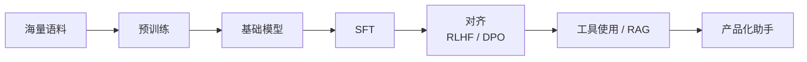

# 05 预训练、指令微调与对齐

Transformer 只是骨架，真正让“大模型”出现能力跃迁的是训练范式的变化。理解 LLM，必须把 `预训练`、`SFT`、`对齐`、`工具使用` 放在一条连续链路里看。

## 1. 预训练到底在做什么

预训练最常见的目标是：

`给定前文，预测下一个 token`

它看起来像一个非常简单的任务，但当训练数据足够大时，模型为了把这个目标做好，会被迫学习：

- 词法与语法
- 事实共现
- 文档结构
- 常见推理模式
- 代码语法
- 多语言映射

因此，预训练本质上是在压缩互联网和文本世界中的统计规律。

## 2. 预训练数据为什么重要

模型能力不只取决于参数量，还取决于数据：

- 覆盖面是否广
- 噪声是否过大
- 是否有大量重复
- 是否包含代码、数学、对话、说明文、表格等多种形式

数据质量直接影响：

- 事实记忆
- 语言风格
- 指令服从
- 错误偏好

## 3. Scaling：为什么“更大”常常真的更强

大模型时代有一个重要经验规律：当参数、数据和训练算力一起增长时，loss 会以相对平滑的方式下降，能力也会随之上升。

如果用更技术化的说法，研究界经常用 `scaling laws` 描述：

- 模型容量不够，表达上限受限
- 数据不够，模型会记忆或过拟合
- 训练算力不够，模型没被训练到足够收敛

因此参数、数据和计算预算必须协同增长。只堆一个维度，往往效率不高。

## 4. 预训练目标为什么如此统一

大部分自回归语言模型都在最小化：

`L = -Σ log P(x_t | x_<t)`

也就是标准的 next-token prediction。它看起来简单，但有三个极强的工程优势：

- 训练目标统一，所有文本都能直接拿来用
- 不需要为每个任务设计单独标签
- 训练出的模型天然支持生成

这种统一目标让互联网文本、代码、说明书、对话、论文，都能进入同一个训练管道。

## 5. 数据工程：预训练真正花力气的地方

真实世界的预训练并不是“把网页全喂进去”。数据工程通常包括：

- 清洗乱码、模板页、广告页
- 去重，避免模型反复记住重复样本
- 语言识别与质量打分
- 文档切分与重组
- 配置不同语料配比，例如代码、自然语言、数学

这一步对最终能力影响极大。很多模型差异并不来自架构，而来自数据混合和清洗策略。

## 6. 预训练模型为什么还不够“好用”

纯预训练模型擅长续写，但不一定擅长“听你指令做事”。例如它可能：

- 风格不稳定
- 不懂聊天格式
- 不知道何时拒绝
- 不会可靠地输出结构化 JSON

原因是：预训练优化的是“还原文本分布”，不是“充当一个产品化助手”。

所以还需要进一步对齐到“人类任务”和“产品接口”。

## 7. SFT：Supervised Fine-Tuning

SFT 的做法是拿一批“输入 -> 理想输出”的样本继续训练模型，让它学会：

- 遵循指令
- 按指定风格回答
- 使用对话模板
- 执行特定任务

例如：

- 用户：解释这段代码
- 助手：给出结构清晰、步骤化的说明

SFT 往往是把基础模型变成“可聊天、可用助手”的第一步。

从训练角度看，SFT 仍然通常是 token-level cross entropy，只不过语料从通用互联网文本变成了“任务格式化后的对话数据”。

## 8. Chat Template 与消息编排为什么重要

很多开发者第一次做助手系统时，会忽略 chat template 的重要性。实际上，聊天模型不是“天生理解 system/user/assistant”，而是训练时见过某种消息排版格式。

例如，一次对话可能会被拼成：

```text
<system> 你是一个代码助手
<user> 解释这段 Python
<assistant> ...
```

模板的选择会直接影响：

- 指令优先级
- 多轮上下文边界
- 工具调用 token 布局
- 模型对角色身份的理解

## 9. 对齐：为什么还要继续优化偏好

即使做了 SFT，模型仍可能出现：

- 回答啰嗦或敷衍
- 风格不一致
- 不安全内容处理不稳定
- 用户偏好满足不够好

于是出现偏好对齐方法。

### 9.1 RLHF

`Reinforcement Learning from Human Feedback`

流程通常是：

1. 让模型对同一输入给出多个回答
2. 由人工标注偏好排序
3. 训练奖励模型
4. 用强化学习优化主模型

它的目标不是让模型更“真实”，而是让输出更符合人类偏好和产品目标。

它的优点是目标表达力强，缺点是流程复杂、训练不稳定、成本高。

### 9.2 DPO

`Direct Preference Optimization`

它试图绕开复杂的 RL 流程，直接利用偏好对训练目标施加约束。工程上更简洁，因此很受欢迎。

你可以粗略理解为：

- 偏好数据告诉模型“回答 A 比回答 B 更好”
- DPO 直接推动模型提高 A 的相对概率、压低 B 的相对概率

## 10. Alignment 不是单纯的“安全”

对齐包括但不限于安全。它同时涉及：

- 礼貌与风格
- 指令服从
- 拒答边界
- 多轮对话一致性
- 工具使用偏好
- 结构化输出纪律

所以对齐其实是“产品行为塑形”。

换句话说，预训练决定模型“知道什么”，对齐更大程度决定模型“怎么表现出来”。

## 11. 工具使用为什么重要

纯语言模型有一个天然问题：参数里存的是压缩后的统计知识，不是一个实时可更新的执行环境。

因此模型需要借助外部工具：

- 搜索
- 数据库
- 代码执行
- 计算器
- 检索系统
- 企业内部 API

现代助手能力很大一部分不是“模型自己会”，而是“模型知道什么时候调工具、怎么整合工具结果”。

这本质上把模型从“封闭知识容器”变成了“任务协调器”。

## 12. RAG 在这里处于什么位置

`Retrieval-Augmented Generation` 本质上是把外部知识检索进上下文，再让模型利用这些上下文生成答案。

它适合解决：

- 模型参数知识过时
- 企业私有知识不在预训练数据中
- 需要可引用依据

RAG 并不替代训练，而是补充“实时知识接入”。

更精确地说，RAG 改变的不是参数，而是推理时的上下文条件。

## 13. 一个完整的大模型能力形成链路



## 14. 为什么同样是 Transformer，能力差别会很大

因为最终能力来自一整条链，而不是某一层代码：

- 数据质量
- tokenizer
- 模型规模
- 训练配方
- 指令微调数据
- 偏好对齐目标
- 工具系统设计

所以“架构一样”不代表“产品能力一样”。

## 15. 开发者在项目里如何使用这套思想

- 基础模型负责通用表示能力
- SFT 负责贴近任务接口
- 对齐负责稳定输出风格和行为边界
- RAG 负责接入外部新知识
- 规则系统负责最终约束和流程控制

如果你在做企业应用，最实用的原则通常不是“训一个从零开始的模型”，而是把这条能力链拆开，各自选性价比最高的方案。

## 16. 小结

大模型能力不是某天突然冒出来的，而是“预训练学世界统计规律 + 微调学任务接口 + 对齐学人类偏好 + 工具系统补外部能力”共同作用的结果。真正的工程竞争力往往不在某一个单点，而在这条链条是否被整体打通。

## 17. 学以致用

如果你正在做一个 AI 应用，可以先拿当前项目问自己三个问题：

1. 我的问题更像“知识不够”，还是“行为不稳”
2. 我更该先做 RAG，还是先做微调
3. 我有没有把评测放在技术决策前面

这三个问题，会把这一章从“概念理解”变成“项目判断力”。

## 18. 继续往下读

这章解决的是“能力从哪里来”。接下来最自然的两条延伸是：

- [11-embeddings-rag-and-vector-search.md](./11-embeddings-rag-and-vector-search.md)：外部知识怎么接进系统
- [12-fine-tuning-lora-and-distillation.md](./12-fine-tuning-lora-and-distillation.md)：怎样把模型行为塑造成你的模型
