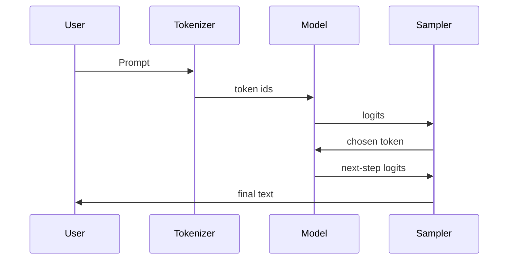
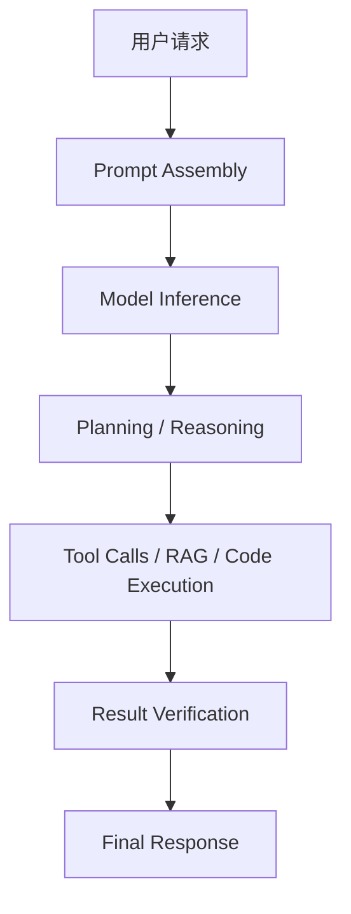

# 06 推理流程与推理模型

## 这章怎么读

这一章里“推理”有两个意思，很容易混：

- `inference`：模型运行并生成输出
- `reasoning`：模型更擅长多步思考、规划和验证

所以读这章时，要刻意把“生成流程”与“思考能力”分开看。  
前者讲系统怎么跑，后者讲模型在这个流程里能不能做更复杂的事。

## 先记住这个生成循环


“推理”这个词在大模型领域有两层意思，经常被混淆：

- `inference`：模型运行时生成输出的过程
- `reasoning model`：更擅长多步思考、规划和验证的模型类型

这两者有关，但不是一回事。

## 1. 模型 inference：回答问题时到底发生了什么

当用户输入一段文本时，系统一般经历以下步骤：

1. 用 tokenizer 转成 token IDs
2. 送入模型得到 logits
3. 通过采样或搜索选出下一个 token
4. 把新 token 追加到上下文
5. 重复直到结束

这就是 `autoregressive decoding`。



## 2. Logits 是什么

模型每一步不会直接吐出“答案字符”，而是输出一个长度等于词表大小的分数向量。这个向量叫 `logits`。

对 logits 做 softmax，就得到每个 token 的概率分布：

`P(token_i) = exp(logit_i / T) / Σ exp(logit_j / T)`

这里的 `T` 就是 temperature。也就是说，采样并不是语言模型的附属功能，而是从分数空间映射到动作空间的关键步骤。

## 3. Decoding：从概率分布到实际输出

### 3.1 Greedy

每一步都选概率最大的 token。优点是稳定，缺点是容易呆板、重复。

### 3.2 Temperature

通过调整温度，改变分布尖锐程度：

- 温度低：更保守
- 温度高：更发散

### 3.3 Top-k

只在概率最高的前 `k` 个 token 中采样。

### 3.4 Top-p

只在累计概率达到阈值 `p` 的 token 集合中采样。比固定 top-k 更自适应。

### 3.5 Beam Search

保留多个候选路径并比较整体得分。传统生成任务常用，但在聊天模型里较少作为主策略。

### 3.6 Repetition penalty 与 stop rules

工程上还常加：

- 重复惩罚，降低无限循环或机械重复
- 停止序列，控制输出边界
- 最长长度约束，限制成本

这些看似细节，实际上对产品体验影响很大。

## 4. 生成循环的真实样子

如果写成伪代码，典型生成流程大致如下：

```text
tokens = tokenize(prompt)
cache = empty

while not finished:
  logits, cache = model(tokens[-1], cache)
  next_token = sample(logits, temperature, top_p, top_k)
  tokens.append(next_token)
  if next_token is stop_token:
    break
```

真正服务端系统会复杂得多，因为还要处理：

- batch 合并
- prefix cache
- 并发请求
- 流式输出
- 工具调用中断与恢复

但底层核心循环就是这个自回归过程。

## 5. 为什么输出不是完全确定的

因为模型生成的是概率分布，而不是唯一答案。即便同一个 prompt，只要采样设置不同，输出就可能不同。

这也是为什么生产环境要明确控制：

- temperature
- top-p
- repetition penalty
- stop sequences

你可以把“模型权重”理解为能力边界，把“decoding 策略”理解为行为策略。

## 6. 推理阶段的两个瓶颈

### 6.1 首 token 延迟

模型需要先“看完输入”才能开始生成，这部分成本常被称为 prefill。

### 6.2 逐 token 生成吞吐

后续每个 token 都要继续做一次前向推理，这部分成本常被称为 decode。

这两个阶段优化手段不同。

## 7. Prefill 与 Decode 的差异

- `prefill`：输入长、并行度高、计算密集
- `decode`：每次只来一个新 token，更依赖内存和 cache 带宽

这也是为什么很多推理优化都围绕 `KV Cache` 展开。

更具体地说：

- prefill 像一次大矩阵批处理
- decode 像大量小步、频繁访存的在线过程

因此同一块 GPU，在两个阶段的瓶颈可能完全不同。

## 8. 服务端推理为什么比单次 forward 难得多

生产环境并不是“一次 prompt，一次输出”，而是一个动态调度系统。推理服务通常还要处理：

- 多用户并发
- 长短请求混排
- token streaming
- 批处理调度
- prefix 复用
- 工具调用后的上下文回注

这也是为什么同一个模型，在 notebook 中能跑，并不代表它已经是一个成熟可用的推理系统。

## 9. 什么是“推理模型”

今天常说的“推理模型”，指的是更擅长：

- 分步规划
- 中间检查
- 调用工具
- 自我验证
- 长链路任务完成

它们通常仍然基于 Transformer，但在以下方面更强：

- 训练数据更强调多步任务
- 对齐目标更鼓励可靠步骤
- 测试时更愿意花额外算力

## 10. 测试时算力为什么重要

传统模型常被理解为“一次前向，直接出答案”。推理模型则更像：

- 先做草稿
- 再检查
- 必要时重试
- 调工具验证关键事实

这类能力本质上是在推理时增加计算路径和决策深度。

如果从系统角度看，`test-time compute` 的意思是：

- 不只给模型一次机会
- 允许多条候选轨迹竞争
- 允许把中间结果拿去验证

## 11. CoT、Self-Consistency、Reflexion 的位置

这些方法都属于“让模型在推理时显式或隐式使用更多中间过程”的技术路线。

- `Chain-of-Thought`：鼓励逐步展开中间推理
- `Self-Consistency`：采样多条思路，再选择更一致的结论
- 自我反思类方法：让模型检查自己的错误

它们并不是新的底层网络结构，而是推理和训练范式上的增强。

## 12. Agent 为什么和推理模型联系紧密

当任务变复杂时，模型不能只靠一次续写完成，而是需要：

- 分解任务
- 选择工具
- 读回结果
- 更新计划

这就自然走向了 Agent 系统。可以把它理解成“把推理过程外化为一个可观察、可执行的工作流”。

这里一个常见误区是：Agent 能力并不等于模型内部智力更高，它往往也来自更好的状态管理、工具接口和回路设计。

## 13. 一个现代推理系统的真实结构



## 14. 需要警惕的误区

- 推理模型不是“会思考的人脑”，它仍是统计模型
- 更长的思考过程不等于更正确
- 显示思维链不等于真实内部推理机制
- Agent 能力常常来自系统设计，而不仅是底层模型

## 15. 小结

`inference` 解释的是模型如何运行，`reasoning model` 解释的是模型如何更有效地利用运行时算力和中间步骤完成复杂任务。前者是底层执行过程，后者是能力组织方式。真正的现代 LLM 系统，往往同时要把两者都做好：底层推理栈够快，上层推理流程够稳。

## 16. 学以致用

这一章最适合做的实践，是观察一个真实推理请求的完整链路：

- prompt 是怎么被拼出来的
- 模型是怎么逐 token 输出的
- 工具调用和验证是插在什么位置的

只要你能把这条链路画出来，你对“模型在运行时到底做了什么”就已经建立了稳定直觉。

## 17. 继续往下读

如果你更关心“它为什么跑得慢、为什么成本高”，下一章应该看：

- [07-efficient-inference-quantization-and-kv-cache.md](./07-efficient-inference-quantization-and-kv-cache.md)

如果你更关心“它如何接入外部知识和系统能力”，接下来更适合看：

- [11-embeddings-rag-and-vector-search.md](./11-embeddings-rag-and-vector-search.md)
- [14-agents-and-tool-use-systems.md](./14-agents-and-tool-use-systems.md)
