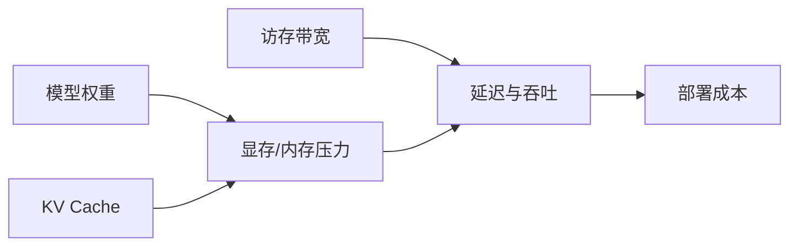
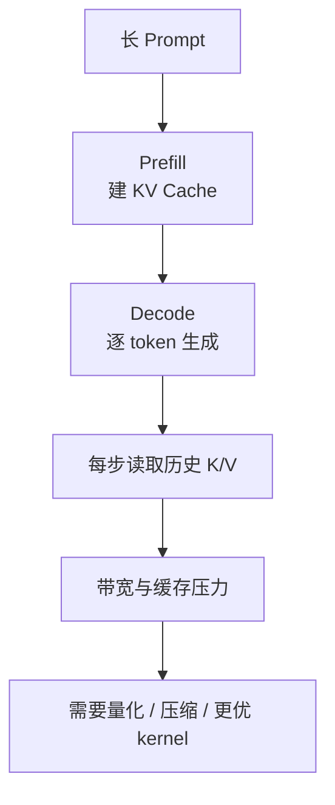

# 07 高效推理：量化、KV Cache 与系统瓶颈

## 这章怎么读

如果你之前只从“模型参数量”理解部署成本，这章会帮你把视角切到更真实的系统层。  
上线时最常见的限制往往不是“模型不会答”，而是“显存、带宽、延迟、吞吐扛不住”。

读这章时，建议一直追问：

- 成本到底花在权重、激活还是 KV Cache
- 哪些优化是在压内存，哪些是在省带宽，哪些是在减算力
- 为什么很多优化会互相耦合，而不是单独生效

## 先记住这个瓶颈图

当模型足够大时，真正难的问题往往不再是“它会不会”，而是“它能不能在成本可接受的条件下跑起来”。这一章解释上线和本地部署中最关键的推理系统问题。

## 1. 推理成本来自哪里

主要有三块：

- 模型权重占用的内存或显存
- 运行时激活与 KV Cache
- 访存和带宽，而不只是纯算力

很多新手只关心参数量，但实际部署时常见情况是：GPU 算力还没跑满，显存和带宽先成了瓶颈。

## 2. 权重量化

量化是把高精度数值用更低比特存储和计算。

例如：

- FP16
- BF16
- INT8
- INT4

量化的收益：

- 降低模型占用
- 减少内存带宽压力
- 在某些硬件上加速推理

量化的代价：

- 精度损失
- 实现复杂度上升
- 不同硬件支持程度不同

如果从实现角度进一步细分，量化还有几条常见轴：

- 对称量化 vs 非对称量化
- 逐张量 vs 逐通道 vs 分组量化
- 仅存储低比特 vs 连计算也低比特

这些设计会决定解码时需要保存多少 scale / zero-point，以及 dequant 的成本有多高。

## 3. 权重量化不是全部

很多人第一次接触本地模型时，只关注 GGUF 或 INT4 权重。但一旦上下文变长，另一个大头会出现：`KV Cache`。

这时你会发现：

- 权重决定“模型静态有多大”
- KV Cache 决定“运行中还能撑多长上下文、多少并发”

## 4. KV Cache 是什么

在自回归生成时，每一层、每个历史 token 都会产生对应的 `K` 和 `V`。如果每一步都重新计算全部历史，成本太高，因此系统会把历史 `K/V` 缓存起来。

下一步生成时，只需要：

- 为新 token 计算新的 `Q/K/V`
- 用新 `Q` 与缓存中的历史 `K` 做注意力
- 按权重读取历史 `V`

这就是 KV Cache。

它本质上是在做一件很工程化的事情：用空间换时间。

## 5. KV Cache 的内存到底怎么估

一个粗略但非常实用的估算公式是：

`KV bytes ≈ 2 * layers * seq_len * kv_heads * head_dim * bytes_per_element * batch`

其中：

- 前面的 `2` 表示同时存 K 和 V
- `layers` 是层数
- `seq_len` 是当前上下文长度
- `kv_heads * head_dim` 表示每层每个 token 的 KV 表示大小
- `bytes_per_element` 取决于 FP16/INT8/INT4 等格式

从这个公式可以看出，长上下文和高并发会直接把 KV 内存推高。

## 6. KV Cache 为什么会爆

因为它和以下因素近似成乘法关系：

- 层数
- 注意力头数或 KV 头数
- hidden 维度
- 上下文长度
- batch size / 并发请求数

直观上：

- 参数是“模型本体”
- KV Cache 是“运行时工作内存”

长上下文和高并发时，工作内存可能比你想象中大得多。

## 7. Prefill 与 Decode 为什么对 KV Cache 敏感

Prefill 时需要为整段输入建立缓存，Decode 时每生成一个 token 都要频繁读写缓存。因此 decode 阶段非常依赖：

- cache 大小
- 带宽
- 数据布局
- kernel 实现

如果把推理栈放到 roofline 模型里看，decode 常常更偏向 memory-bound，而不是 compute-bound。

## 8. 常见推理优化手段

### 8.1 FlashAttention

通过更高效的内存访问模式和 kernel 设计，减少 attention 的中间显存占用，提升吞吐。

它最重要的思想不是“公式变了”，而是改变了中间结果的 materialization 方式，尽量少把巨大注意力矩阵完整写回显存。

### 8.2 Paged Attention

把 KV Cache 做分页管理，降低碎片并改善服务端批处理能力。vLLM 因此很受欢迎。

这更像操作系统思维进入了推理系统：缓存不是按请求整块分配，而是用页组织和复用。

### 8.3 Grouped-Query Attention

多个 query 头共享更少的 KV 头，直接减少 KV Cache 大小。

### 8.4 Speculative Decoding

先用小模型草拟多个 token，再由大模型验证，目标是提高吞吐。

它优化的不是单次 attention，而是 token 生成流程的“步数”。

### 8.5 Prefix Caching

当多个请求共享系统提示词或公共前缀时，复用缓存，减少重复 prefill。

## 9. 量化可以压哪些东西

- 权重
- 激活
- KV Cache

这三者的挑战不同。权重量化最成熟，激活量化更难，KV Cache 量化在长上下文时代越来越重要。

原因在于：

- 权重是静态的，可离线校准
- 激活是动态的，分布随输入变化
- KV Cache 既动态，又直接参与 attention 几何关系

## 10. 为什么 KV Cache 量化比想象中难

注意力依赖 `q·k` 的内积关系。即使量化后的向量和原向量在均方误差意义上接近，也不代表注意力分数还能保持准确。

因此，一个好的 KV Cache 压缩方法不只要“数值接近”，还要尽量保护：

- 内积
- 方向
- 排序关系

这也是为什么“低 MSE”不自动等于“低注意力误差”。

## 11. 量化的真正系统代价：不是只有 bit 数

实际部署时，还要问几个更现实的问题：

- 每个 block 是否要存 scale 和 zero-point
- dequant 是否能被 kernel 高效融合
- 压缩后是否减少了带宽瓶颈
- 是否引入了额外的控制流和 cache miss

很多方法理论压缩率很好，但系统实测收益一般，就是因为额外元数据和解码开销吃掉了好处。

## 12. 本地框架为什么强调 GGUF 和 llama.cpp

在本地部署生态里：

- `GGUF` 更像模型权重文件格式
- `llama.cpp` 更像轻量推理框架

它们主打：

- 低门槛部署
- CPU / Apple Silicon / 多后端支持
- 权重量化和本地推理便利性

但随着长上下文需求增加，仅有权重量化已不够，于是 KV Cache 压缩开始重要。

## 13. 一张图理解推理瓶颈

## 14. 开发者需要建立的系统观

- 训练阶段看的是 FLOPs 和数据规模
- 推理阶段看的是延迟、吞吐、显存、带宽、缓存布局
- 长上下文系统的瓶颈常常在缓存，而不只是权重
- 真正的优化是“模型算法 + kernel + 内存管理 + 调度”的综合结果

## 15. 小结

高效推理的关键不是某一个神奇技巧，而是明确瓶颈在哪。随着长上下文和高并发成为常态，`KV Cache` 已经从实现细节变成核心成本项。TurboQuant 就是在这个背景下出现的，因为它试图同时解决压缩率、元数据开销和注意力几何保持这几个经常彼此冲突的问题。

## 16. 学以致用

如果你现在就在做部署，最实用的练习不是一上来改 kernel，而是先回答四个问题：

- 当前瓶颈在参数、KV Cache，还是检索链路
- 当前更缺延迟、吞吐，还是显存
- 哪部分是 compute-bound，哪部分是 memory-bound
- 压缩带来的元数据和解码开销是否值得

这四个问题会决定你后续所有优化动作是否靠谱。

## 17. 继续往下读

如果你想看一个更前沿、也更聚焦 KV Cache 的具体优化案例，下一章就是：

- [08-turboquant.md](./08-turboquant.md)
