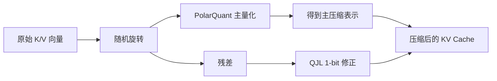

# 08 TurboQuant：极低比特 KV Cache 压缩

TurboQuant 不是新的大模型架构，而是推理阶段的缓存压缩技术。它的目标很明确：把 `KV Cache` 压得非常小，同时尽量不破坏注意力质量。

## 1. 技术背景

当上下文很长时，模型的内存瓶颈往往不在参数，而在 KV Cache。传统权重量化只能解决“模型本体太大”，不能直接解决“历史上下文太贵”。

因此，研究者开始关注：

- 如何压缩 K/V 向量
- 如何在极低比特下保持注意力准确性
- 如何在在线推理中边生成边压缩

TurboQuant 就是在这个问题空间里提出的。

## 2. 它解决的核心矛盾

如果你把向量压得太狠，会发生两类误差：

- 数值误差：向量每个坐标都偏了
- 几何误差：向量间的角度和内积被破坏

对注意力来说，第二类更致命，因为模型排序关注对象主要依赖 `q·k`。

所以 TurboQuant 的目标不是单纯减小 `MSE`，而是尽量保住“谁和谁更相关”这件事。

## 3. 论文与公开时间

Google Research 在 `2026-03-24` 发布了 TurboQuant 介绍，并给出 ICLR 2026 论文页。其核心定位是：

- `training-free`
- 面向 `online KV cache compression`
- 在极低比特下保留较好的注意力质量

## 4. 核心思想

可以把 TurboQuant 理解成两层压缩：

1. 主压缩：把向量高效压到很低 bit
2. 误差修正：用极低成本补偿最影响内积的部分

根据 Google Research 在 `2026-03-24` 的说明以及 ICLR 2026 论文页，TurboQuant 的目标不是单纯优化 MSE，而是同时兼顾：

- 均方误差
- 内积失真

这一点非常关键，因为 attention 的得分本质上是 query 与 key 的点积。

## 5. 直觉图

## 6. 第一步：随机旋转

随机旋转的作用不是“神秘增强”，而是让向量分量在统计上更均匀、分布更规整，降低后续极低比特量化的难度。

你可以把它理解成：

- 原始坐标系里，某些维度可能非常尖锐
- 旋转后，信息被更均匀地摊开
- 这样更容易做低比特编码

它和很多高维近似算法中的“预条件化”思想相通。

更具体一点说，随机旋转会减少“少数维度承载过多能量”的问题，从而让后续量化更接近各向同性假设。

## 7. 第二步：PolarQuant 主量化

TurboQuant 的主压缩部分使用了 `PolarQuant` 思想。它不是单纯逐维四舍五入，而是更关注如何用适合向量几何的方式表达信息。

从直觉上说，它试图把“方向”和“尺度”的主要信息，用更紧凑的编码保存下来。

相比朴素逐维量化，这样做的优势是：

- 更适合高维向量
- 更能保留主要几何结构
- 能减少某些额外归一化带来的开销

根据 Google Research 对 PolarQuant 的描述，它的重要价值之一是避免传统归一化量化所需的额外量化参数开销，也就是常说的 scale / zero-point 元数据负担。

## 8. 第三步：QJL 残差修正

主量化之后仍会留下误差。TurboQuant 的关键创新之一，是对这部分残差加一层 `QJL` 风格的 1-bit 修正。

这里的直觉是：

- 主量化已经保住了大部分结构
- 剩下少量误差如果直接丢掉，会影响内积
- 于是用极便宜的附加编码，把“最值得修正”的误差补回来

Google 的公开说明里把这一层描述成一种高效的偏差消除手段。重点不是精确恢复原向量，而是让 attention score 的估计更准。

## 9. 为什么它适合 KV Cache

KV Cache 有几个特殊要求：

- 必须能在线写入
- 读取非常频繁
- 对内积误差很敏感
- 预算极度有限，因为缓存规模很大

TurboQuant 的设计刚好贴合这些约束，因此比一些只看静态压缩率的方法更实用。

OpenReview 摘要里也强调了它面向 `online applications`，这是它区别于一些只能离线压缩、不能顺滑接入生成流程的方法的关键点。

## 10. 为什么不是所有量化都能替代它

如果只做普通低比特量化，可能会出现：

- 表面 MSE 不错
- 但注意力排序明显变差
- 长上下文质量下降更明显

TurboQuant 的区别在于，它把“内积保持”作为重点优化目标，而这正是 attention 的核心。

这可以理解为两种优化哲学的差别：

- 普通量化：尽量让每个数值别偏太多
- TurboQuant：尽量让“相似度判断”别偏太多

## 11. 为什么“零额外开销”这件事那么重要

很多量化方案理论 bit 数很好看，但现实里需要保存每个 block 的归一化常数、缩放因子或码本索引。这样一来，账面上的 3 bit 可能在系统里变成 4 bit、5 bit，甚至更多。

TurboQuant 所在的研究方向之所以重要，是因为它正面解决了：

- 低比特压缩本身
- 量化参数的附加开销
- attention 相关的几何失真

这三者往往不能同时做好。

## 12. 它在系统层的意义

如果 KV Cache 能大幅缩小，就可能带来：

- 更长上下文
- 更低显存占用
- 更高并发
- 更低带宽压力
- 在本地设备上运行更大的任务

Google Research 的公开结果中提到，它在若干长上下文基准上表现接近无损，并能把 KV cache 压到约 3 bit 量级，同时显著降低内存占用。

## 13. 它与 llama.cpp 生态的关系

像 `turboquant_plus` 这样的仓库，本质上是在把 TurboQuant 类方法接到 `llama.cpp` 这种本地推理框架中，验证：

- 质量损失有多大
- 压缩比是否值得
- 推理速度有没有实际提升
- 对不同模型和上下文长度是否稳定

也就是说，它是研究成果走向工程试验的一步。

## 14. 需要知道的边界

TurboQuant 不是“白送收益”，它仍有边界：

- 实现复杂度更高
- kernel 和数据布局要协同设计
- 不同模型、不同硬件上的收益未必一致
- 长上下文、检索增强、代码场景下的损伤模式可能不同

任何压缩技术最终都要回到真实任务指标验证。

尤其需要警惕的是：一个方法在 attention logit 计算上加速，不自动等于整个端到端系统吞吐同比例加速。

## 15. 一个开发者心智模型

把推理系统想成一台不断翻阅历史笔记的机器：

- 权重是机器本身
- KV Cache 是运行时记忆笔记
- TurboQuant 是“把笔记压缩得更小，但尽量不影响查阅准确性”

如果笔记压得很小，但关键索引丢了，模型就会“翻错页”。TurboQuant 的价值就在于尽量保住这些索引关系。

## 16. 小结

TurboQuant 代表的是推理优化进入更精细几何层面的趋势。它不再满足于“数值差不多”，而是针对注意力真正关心的对象，即向量内积与排序关系，设计压缩与修正机制。更重要的是，它试图把这种几何保持做成一种适合在线 KV cache 场景、且额外元数据开销极低的系统方案。

## 参考阅读

- Google Research, *TurboQuant: Redefining AI efficiency with extreme compression*, 2026-03-24
- TurboQuant, *Online Vector Quantization with Near-optimal Distortion Rate*, ICLR 2026
- PolarQuant: *Quantizing KV Caches with Polar Transformation*
