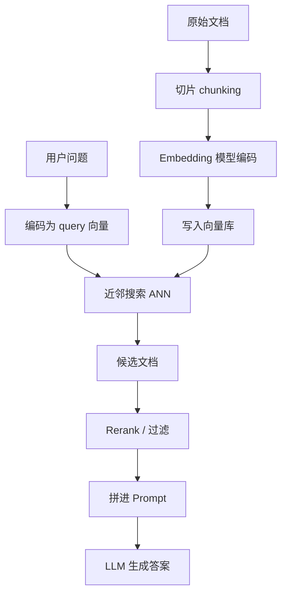

# 11 Embedding、向量检索与 RAG

如果说大模型解决了“会说话、会总结、会生成”的问题，那么 embedding 和 RAG 解决的是另一个同样现实的问题：

“模型怎么接触到参数之外的知识，尤其是你自己的知识。”

做企业 AI 应用时，这往往是最关键的一章。

## 1. Embedding 是什么

Embedding 可以理解成“把一个对象映射成向量”。这个对象可以是：

- 一个词
- 一句话
- 一段文档
- 一段代码
- 一个用户行为

映射后的向量通常有一个重要性质：

语义相近的对象，在向量空间里也更接近。

这让我们可以把“语义检索”变成“向量近邻搜索”。

## 2. 生成模型和 embedding 模型有什么不同

虽然很多人都叫它“模型”，但它们解决的问题不同：

- 生成模型：给定上下文，预测后续内容
- embedding 模型：把输入编码成便于比较和检索的向量

所以 embedding 模型不负责长篇生成，它负责的是：

- 压缩语义
- 支持相似度计算
- 让搜索和召回更智能

## 3. 为什么关键词搜索不够了

传统搜索主要依赖：

- 倒排索引
- 关键词匹配
- BM25 一类统计排序

这对明确术语很有效，但对语义改写、同义表达和长文本理解有限。例如：

- “怎么查看订单剩余有效期”
- “订单还有多久过期”

这两个问题关键词可能差很多，但语义很接近。Embedding 检索正是为了弥补这种差距。

## 4. 向量检索的基本流程

这条链就是典型的 RAG pipeline。

## 5. 为什么要切片 chunking

大文档不能原样全部塞给模型，所以要先切成 chunks。

切片的难点在于：

- 太小：语义不完整，召回片段碎
- 太大：噪声多，召回不精准，还浪费上下文

常见切法：

- 按段落
- 按标题层级
- 按 token 长度
- 结构化文档按表格、代码块、章节切

做 RAG 时，chunking 往往比向量库选型更影响效果。

## 6. 相似度怎么计算

最常见的是：

- cosine similarity
- dot product
- Euclidean distance

在实际 embedding 检索里，cosine 和 dot product 最常见。

关键不在于名字，而在于：

- embedding 模型训练时偏向哪种相似度
- 你的索引实现对哪种度量更友好

## 7. ANN：为什么不是精确搜索全部向量

如果有几百万、几千万个文档向量，不可能每次都和 query 做全量精确比较。

所以实际系统常用 `Approximate Nearest Neighbor`，也就是近似最近邻搜索。

常见思路包括：

- `HNSW`
- `IVF`
- `PQ`

这些方法本质上都在做一件事：

牺牲一点点精确性，换来巨大搜索速度提升。

## 8. 向量数据库是什么

向量数据库并不神秘，本质上是：

- 存向量
- 建近邻索引
- 支持 metadata 过滤
- 支持相似度检索

在真实系统里，它往往不是单独工作的，而是和：

- 文本原文存储
- 元数据过滤
- reranker
- 业务权限系统

一起组成检索层。

## 9. Rerank 为什么常常是效果关键

向量检索的第一步通常更像“召回”，即先找出一批可能相关的候选。

但召回回来后，排名未必最好。这时可以用 reranker 再排一次。

常见做法：

- cross-encoder rerank
- 更强模型做二阶段排序
- 结合业务规则和 metadata 调整顺序

RAG 效果差，很多时候不是“模型笨”，而是召回和排序没做好。

## 10. RAG 解决什么，不解决什么

RAG 很适合解决：

- 模型参数知识过时
- 企业私有知识注入
- 需要可溯源回答
- 长文档问答

RAG 不擅长直接解决：

- 需要稳定输出新风格
- 需要模型学会固定工作流
- 需要把任务行为永久写进模型

这时你可能更该考虑微调。

## 11. 什么时候用 Prompt，什么时候用 RAG，什么时候用微调

一个很实用的判断框架：

- 如果只是临时补上下文，用 prompt
- 如果是外部知识更新频繁，用 RAG
- 如果是行为模式要长期改变，用微调

比如：

- 公司制度库问答：更适合 RAG
- 让模型学会固定客服语气：更适合微调
- 一次性附加几个文档：直接 prompt 即可

## 12. 混合检索为什么很常见

只用关键词检索不够，只用向量检索也未必够。

很多系统会做 hybrid retrieval：

- 关键词/BM25 保证术语精确命中
- embedding 检索补充语义召回
- reranker 统一重排

这是很现实的工程折中，因为业务文本里经常既有“必须精确命中的编号、产品名”，又有“自然语言描述”。

## 13. Metadata 过滤经常被低估

实际业务里，很多文档不是“全库都能查”，而要带过滤条件：

- 租户隔离
- 部门权限
- 时间范围
- 文档类型
- 语言

如果没有 metadata 过滤，RAG 很容易：

- 找到不该给当前用户看的内容
- 把过期内容召回进来
- 让模型在错误知识上自信作答

## 14. RAG 里最常见的失败模式

- 切片不合理，导致召回片段碎或太噪
- embedding 模型不适合当前领域
- query 没改写，召回词不够好
- top-k 过小，漏召回
- top-k 过大，噪声太多
- rerank 缺失
- prompt 里没有明确要求“基于给定文档回答”

很多团队觉得“RAG 不行”，其实只是 pipeline 还没搭对。

## 15. Query rewriting 和 retrieval planning

复杂问题往往不适合直接拿原始用户提问去搜。常见增强方法包括：

- query rewriting：把问题改写得更适合检索
- decomposition：把复杂问题拆成多个子问题
- multi-hop retrieval：分多轮检索

这些方法说明：检索不是一个静态动作，而可能是一个推理过程的一部分。

## 16. RAG 评测应该怎么看

至少要分两层看：

### 16.1 Retrieval 层

- recall
- precision
- hit rate
- MRR / NDCG

### 16.2 Generation 层

- 最终答案正确率
- 是否引用到正确文档
- 幻觉率
- 用户满意度

因为“召回对了”不等于“最后回答就一定对”，反过来也一样。

## 17. Embedding 和向量搜索为什么是 AI 从业者必学

因为只要你做的不是纯开放聊天，而是：

- 企业知识助手
- 搜索增强问答
- 文档问答
- 代码库问答
- 推荐和相似内容匹配

几乎都绕不开 embedding 和向量检索。

## 18. 一个开发者心智模型

可以把 RAG 看成“给模型配了一套外部记忆系统”：

- embedding 负责把知识压成向量索引
- 向量检索负责找回相关记忆
- rerank 负责排优先级
- LLM 负责读这些记忆并组织成回答

## 19. 小结

RAG 的本质不是“把文档塞给模型”，而是把搜索系统、排序系统和生成系统接成一个闭环。它既不是简单数据库查询，也不是纯模型能力，而是两者的结合体。

## 20. 学以致用

如果你想把这一章立刻变成实践，最值得做的是一个最小 RAG baseline：

1. 选 20 篇文档
2. 做 chunking
3. 建一个向量索引
4. 召回后交给 LLM 回答
5. 手工评 20 个问题

只要这个 baseline 跑起来，你对 embedding、向量检索、RAG 和 rerank 的理解就会从“概念级”升级到“系统级”。

## 21. 继续往下读

读完这一章后，最自然的两步是：

- [13-evaluation-safety-and-product-metrics.md](./13-evaluation-safety-and-product-metrics.md)：判断你的 RAG 到底是不是真的有效
- [12-fine-tuning-lora-and-distillation.md](./12-fine-tuning-lora-and-distillation.md)：当 RAG 解决不了行为问题时，该如何继续改造模型

## 参考阅读

- Lewis et al., *Retrieval-Augmented Generation for Knowledge-Intensive NLP Tasks*
- ANN indexing documentation such as HNSW references
