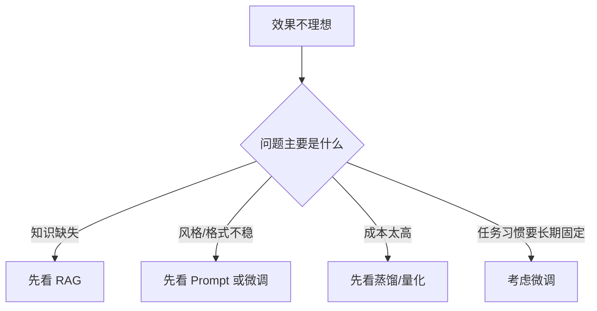
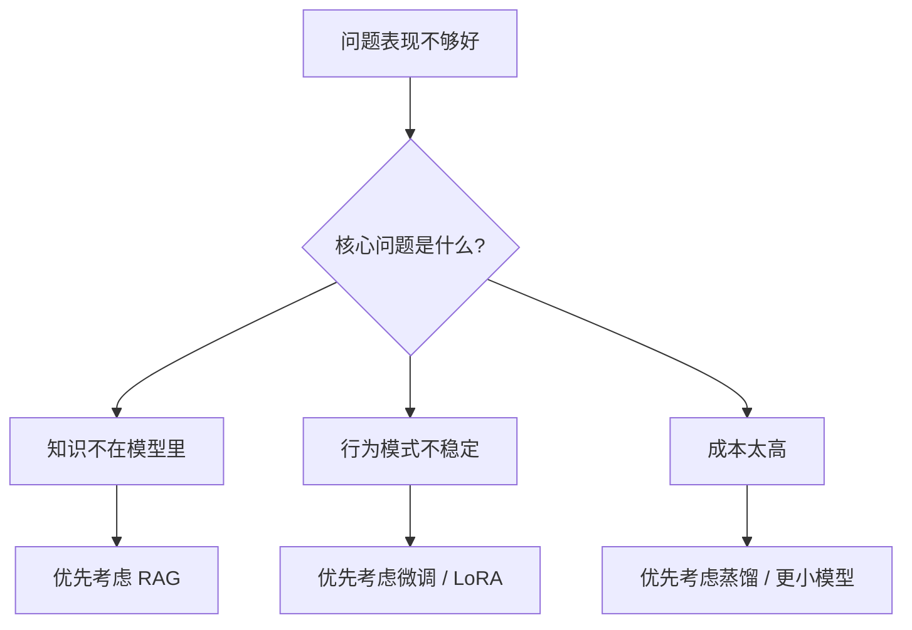

# 12 微调、LoRA 与蒸馏：怎样把模型变成你的模型

## 这章怎么读

很多初学者一遇到效果不理想，就会立刻想到“要不要微调”。  
这章要帮你建立更务实的判断顺序：先分清问题到底出在提示、知识接入、模型行为，还是模型容量，再决定要不要上微调或蒸馏。

读这章时，最重要的是分清 4 个动作的边界：

- Prompt 调整
- RAG 接知识
- 微调改行为
- 蒸馏换更小的运行形态

## 先记住这个决策树

很多项目做到一定阶段都会遇到同一个问题：

“只靠 prompt 和 RAG 还不够，我能不能让模型本身更像我的业务助手？”

这就是微调进入视野的时候。

## 1. 微调到底在改变什么

微调的本质是：在已有基础模型参数上继续训练，让模型更适应某个任务、领域或行为模式。

你可以把它理解成：

- 预训练给了模型通用语言能力
- 微调让它贴近你的目标场景

典型目标包括：

- 更稳定的输出格式
- 更贴近业务语气
- 更强的领域术语掌握
- 更好的特定任务表现

## 2. 什么时候该微调，什么时候不该

微调并不是默认最优解。

### 2.1 更适合先用 prompt / system prompt 的情况

- 只是轻微调整风格
- 规则不复杂，能靠模板表达
- 需求变化快，暂时不想维护训练数据

### 2.2 更适合先用 RAG 的情况

- 问题核心是“知识不在模型里”
- 文档更新频繁
- 需要可追溯依据

### 2.3 更适合微调的情况

- 需要长期稳定改变行为模式
- 输出格式要求强且重复度高
- 需要模型学会特定领域表达和工作方式

## 3. 全量微调为什么贵

全量微调意味着更新模型的大量甚至全部参数。

问题在于：

- 显存开销大
- 训练成本高
- 容易过拟合
- 部署和版本管理更重

因此在大模型时代，越来越多团队会先考虑参数高效微调。

## 4. 参数高效微调 PEFT 是什么

PEFT 的核心思想是：

不去更新全部参数，只更新很小一部分可训练参数。

这样做的好处是：

- 显存更省
- 训练更快
- 更容易为多个任务维护多个适配器

LoRA 是其中最著名的方法之一。

## 5. LoRA 的直觉

LoRA 的基本想法是：

模型原来的权重矩阵 `W` 不直接改，而是学习一个低秩更新：

`W' = W + BA`

其中：

- `A` 和 `B` 是比原矩阵小得多的低秩矩阵
- 真正训练的是 `A` 和 `B`

这意味着：

- 基础模型大部分参数冻结
- 只训练很小一部分增量

### 5.1 为什么“低秩”有意义

它背后的假设是：

让模型适配一个新任务，未必需要在全参数空间里做大改动，很多时候只需要一个相对低维的修正方向。

这是一种非常典型的工程近似：用更少参数逼近足够好的任务适配。

## 6. QLoRA 为什么重要

QLoRA 的思路是：

- 基础模型以低比特量化形式加载
- 仍然在上面训练 LoRA adapter

这样做让“在较小硬件上做微调”变得更现实。

它的重要意义不是新理论，而是把微调门槛进一步压低。

## 7. 微调数据长什么样

微调质量通常非常依赖数据格式和样本质量。

常见数据形式：

- 指令 -> 回答
- 对话多轮样本
- 输入 -> 结构化输出
- 问题 -> 代码修复 / SQL / 分类标签

如果是聊天模型微调，通常还会涉及 chat template 和角色标记。

## 8. 微调最容易踩的坑

- 数据量不够，但问题本质不是微调能解决的
- 样本风格不一致
- 标签质量差
- tokenizer 或模板不匹配
- 评测集和训练集混淆
- 微调后过拟合到狭窄行为

一个很常见的误区是：把“知识缺失”当成“行为缺失”，结果明明应该做 RAG，却跑去微调。

## 9. 蒸馏是什么

蒸馏 `distillation` 可以理解成：

让一个较小的 student 模型去模仿较强的 teacher 模型。

目标可能是：

- 保留主要能力
- 降低推理成本
- 提高部署效率

蒸馏并不是简单复制答案，而常常会让小模型学习：

- teacher 的概率分布
- 中间表示
- 多样化生成结果

## 10. 为什么蒸馏在工程上很重要

因为很多生产场景不需要“最强模型”，而需要：

- 更低延迟
- 更低成本
- 更稳定吞吐

这时一个蒸馏后的小模型，可能比一个超大模型更适合上线。

## 11. 微调与蒸馏的关系

它们不是替代关系，而是不同层面的手段：

- 微调：让模型更适合你的任务
- 蒸馏：让更小模型继承更大模型的能力

你甚至可以：

1. 用强模型生成高质量数据
2. 微调或蒸馏一个更小的模型
3. 把小模型部署到成本敏感场景

## 12. DPO 和偏好微调在这里的关系

本章主要讲任务适配和参数高效训练，但要知道：

- SFT 更多在学“怎么回答”
- DPO / 偏好优化更多在学“更偏好哪种回答”

两者常常配合使用。

## 13. 如何选择：Prompt、RAG、微调、蒸馏

## 14. 一个务实的项目策略

很多团队最稳的做法不是一开始就微调，而是：

1. 先用 prompt 把问题定义清楚
2. 再用 RAG 补外部知识
3. 确认瓶颈确实在行为模式后，再考虑微调
4. 成本不合适时，再考虑蒸馏

这条路线通常比“先训再说”更省钱也更可控。

## 15. 评测为什么必须先于微调

如果没有评测集，你根本不知道：

- 微调前差在哪
- 微调后是否真的变好
- 是整体变好，还是只在几个示例上变好

所以微调从来不是“收集点样本就开始训”，而应该先配套评测。

## 16. 小结

微调、LoRA 和蒸馏的共同目标，都是让模型更适合现实业务场景。但它们各自解决的问题不同：微调改行为，LoRA降门槛，蒸馏降成本。真正成熟的团队，往往不是迷信某一种方法，而是先判断瓶颈，再选最合适的改造手段。

## 17. 学以致用

在你的项目里，先不要急着收集训练数据，先做一个判断表：

- 如果缺的是知识，用 RAG
- 如果缺的是行为一致性，用微调
- 如果缺的是成本效率，用蒸馏

只要这个判断清楚了，后面无论是 LoRA 还是 QLoRA，都会变成“解决问题的工具”，而不是“为了追热点而上技术”。

## 18. 继续往下读

做完模型改造之后，最自然的下一步不是继续调参数，而是：

- [13-evaluation-safety-and-product-metrics.md](./13-evaluation-safety-and-product-metrics.md)

因为没有评测，你根本无法证明微调或蒸馏真的让系统变好了。

## 参考阅读

- Hu et al., *LoRA: Low-Rank Adaptation of Large Language Models*
- QLoRA related work
