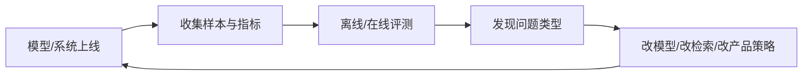
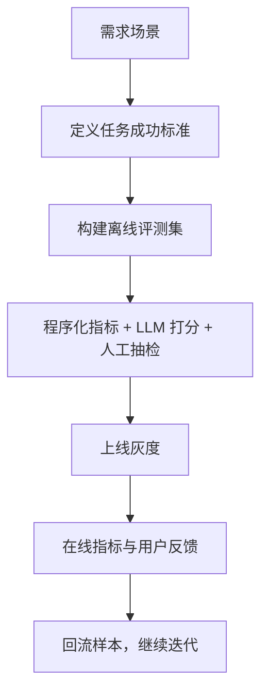

# 13 评测、安全与产品指标：没有评测的 AI 系统基本不可控

## 这章怎么读

这章不是“收尾章节”，而是整个 AI 项目能不能持续迭代的控制台。  
如果没有评测，前面学过的 RAG、微调、Agent 几乎都没法稳定优化，因为你不知道改动到底变好了还是变差了。

读这章时，建议始终区分 3 层问题：

- 模型本身答得对不对
- 系统链路有没有把正确信息送到模型面前
- 产品层的体验、成本和风险是不是可接受

## 先记住这个反馈闭环

很多 AI 项目一开始都很像：

- demo 很惊艳
- 几个例子看起来不错
- 一上线就暴露大量问题

根本原因往往不是模型不够大，而是没有建立稳定的评测与反馈机制。

## 1. 为什么评测是 AI 项目的生命线

传统软件里，一个函数对不对，往往可以靠确定性测试判断。AI 系统不一样：

- 输出是概率性的
- 同一个问题可能有多个合理答案
- 用户输入空间是开放的

这意味着如果没有评测，你很难知道：

- 模型到底有没有变好
- 改动提升了哪一类问题
- 成本上涨是否值得

## 2. 评测至少要分三层

### 2.1 模型层

关注：

- 准确率
- pass@k
- 幻觉率
- 推理题表现

### 2.2 系统层

关注：

- 检索召回是否正确
- 工具调用是否成功
- JSON 是否可解析
- 超时和重试率

### 2.3 产品层

关注：

- 用户完成任务了吗
- 用户是否满意
- 延迟和成本是否可接受

一个真实可用的 AI 产品，必须同时看这三层。

## 3. 离线评测为什么先于在线评测

离线评测的作用是建立一个可重复、可比较的基准。

典型材料包括：

- 固定测试集
- 标准答案或参考答案
- 评分脚本
- 人工审核样本

没有离线评测，你几乎无法可靠地比较：

- 新模型 vs 旧模型
- 新 prompt vs 旧 prompt
- 新检索策略 vs 旧策略

## 4. 在线评测看什么

离线好，不代表上线就好。在线评测还要关注：

- 用户采纳率
- 任务完成率
- 平均响应延迟
- 每次请求成本
- 用户是否反复追问或纠错

AI 产品里，很多改动会出现这种情况：

- 离线指标上升
- 用户体验反而下降

因为模型可能变得更长、更慢、更啰嗦。

## 5. AI 评测为什么比传统软件测试更难

原因至少有四个：

- 输出非确定
- 任务目标有时模糊
- 人类偏好参与评分
- 系统链路长，问题来源复杂

例如一个 RAG 问答答错了，问题可能来自：

- 检索没召回
- rerank 选错
- prompt 拼装有误
- 模型忽略了证据
- 模型产生了幻觉

所以评测不能只看最终文本，还要分解链路。

## 6. LLM-as-a-judge 能不能用

可以用，但不能盲信。

它适合：

- 大规模初筛
- 风格和结构打分
- 帮助人工减少工作量

它不适合独立担任最终裁判，尤其在：

- 事实真伪判断
- 微妙安全边界
- 高价值业务决策

更稳的做法通常是：

- 规则检查
- 程序化指标
- LLM 评分
- 人工抽检

组合使用。

## 7. 幻觉到底是什么

幻觉 `hallucination` 不是“模型胡说八道”这么简单。更准确地说，它指的是：

模型生成了看似合理、但没有可靠依据或与事实不符的内容。

它常见的来源包括：

- 参数知识过时
- 检索没命中
- 模型过度补全
- 指令不够明确

应对方式通常不是单点修复，而是：

- 提升 grounding
- 更好的检索
- 明确引用依据
- 输出约束与校验

## 8. 安全不是一个单独开关

AI 安全不只是“加个敏感词过滤器”，而是一整套防线：

- 输入侧防护
- 模型行为边界
- 工具权限限制
- 输出审核
- 人工升级路径

你可以把它理解成传统系统里的“纵深防御”在 AI 世界的对应物。

## 9. Guardrails 在哪里起作用

典型 guardrails 包括：

- schema 校验
- 拒答策略
- 工具调用白名单
- 正则/规则检查
- 风险分类器

它们不一定能让模型更聪明，但能让系统更不容易越界。

## 10. Red Team 为什么必要

如果你只拿正常输入测模型，很容易高估系统可靠性。

Red teaming 的作用是故意找麻烦，包括：

- prompt injection
- 越权请求
- 长尾脏输入
- 模棱两可的危险请求

这类测试在 Agent 和工具调用系统里尤其重要。

## 11. 产品指标为什么不能只看准确率

对于真实 AI 产品，常见更关键的指标可能是：

- 首 token 延迟
- 完整响应时延
- 每千次请求成本
- 每任务成功率
- 用户二次追问率
- 用户满意度

一个“更聪明但更慢更贵”的模型，在产品上可能未必更优。

## 12. 一个实用的评测框架

这张图表达的重点是：评测不是一次性动作，而是闭环。

## 13. RAG、微调、Agent 的评测关注点有什么不同

### 13.1 RAG

重点看：

- 召回率
- 引用是否正确
- grounded answer 比例

### 13.2 微调

重点看：

- 目标行为是否更稳定
- 是否过拟合
- 其他任务是否退化

### 13.3 Agent

重点看：

- 计划是否有效
- 工具调用是否成功
- 多步任务完成率
- 是否出现死循环和越权

## 14. 为什么“看起来不错”是危险信号

AI 项目里最危险的状态之一就是：

- 团队成员主观感觉还不错
- 但没有系统性证据

因为这种状态下，你无法回答最关键的问题：

- 比上周更好了吗
- 比候选方案 B 好吗
- 代价值得吗

## 15. 一个从业者必须养成的习惯

- 先定义成功标准，再调模型
- 先留评测集，再收训练数据
- 先拆链路，再定位错误
- 先看用户任务完成，再看模型是否“很会说”

## 16. 小结

没有评测的 AI 系统，本质上就是不可控系统。模型能力、系统链路、安全边界和产品体验，最后都要通过评测体系连接起来。真正成熟的 AI 团队，不是只会调 prompt，而是会搭一个能持续发现问题、量化问题、修复问题的闭环。

## 17. 学以致用

如果你现在已经有一个 demo，不管它是 RAG、微调后模型，还是简单聊天助手，都建议你立刻补三样东西：

1. 一个固定的小评测集
2. 一个最小错误分类表
3. 一个记录延迟和成本的表格

这三样东西一旦有了，你的项目就从“感觉在进步”变成了“可以被证据驱动地进步”。

## 18. 继续往下读

当系统已经能被评测和约束后，下一步如果你想让它从“回答问题”升级成“完成任务”，最适合读的是：

- [14-agents-and-tool-use-systems.md](./14-agents-and-tool-use-systems.md)

## 参考阅读

- Holistic evaluation related work
- LLM safety and red-teaming best practices
