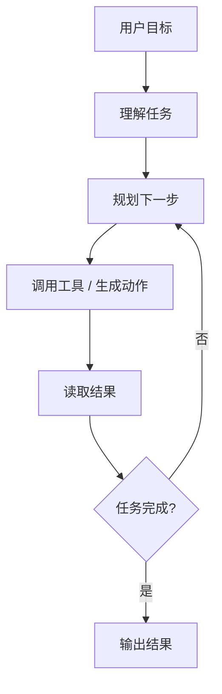
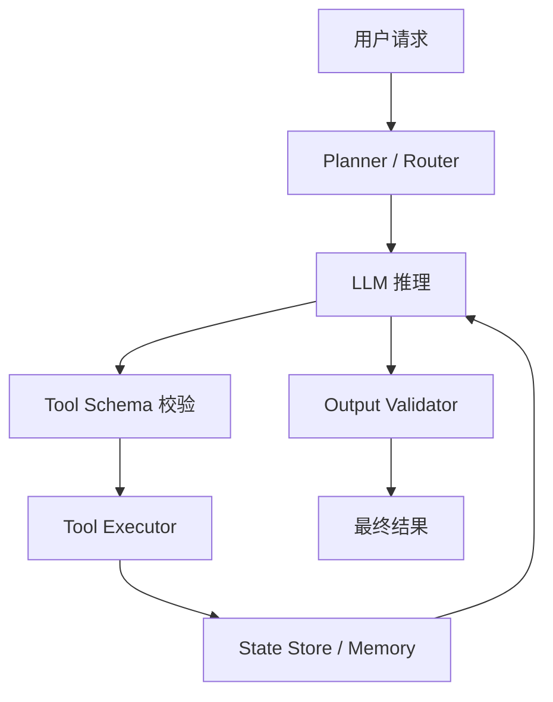

# 14 Agent 与工具使用系统：从“会回答”到“会完成任务”

单纯的聊天模型，最擅长的是在上下文里生成文本。但现实任务往往需要更多东西：

- 查知识
- 调 API
- 执行代码
- 拆分子任务
- 根据结果继续行动

这就是 Agent 系统出现的背景。

## 1. Agent 到底是什么

最朴素的定义是：

Agent 是一个能够感知输入、规划步骤、调用工具、读取结果并持续推进任务的 AI 系统。

注意，这里说的是“系统”，不只是底层模型。

也就是说，Agent 通常由下面几部分共同组成：

- LLM
- prompt / system policy
- 工具接口
- 状态管理
- 执行循环
- 权限与约束

## 2. Workflow 和 Agent 的区别

这两个词很容易混。

### 2.1 Workflow

步骤基本固定，例如：

1. 先检索
2. 再总结
3. 最后生成报告

### 2.2 Agent

步骤可以根据中间结果动态决定，例如：

- 先搜一轮
- 发现信息不足，再换查询词
- 还不够，再调用另一个工具

因此：

- workflow 更可控
- agent 更灵活

在生产上，很多所谓 Agent 系统其实是“带少量动态分支的 workflow”。

## 3. 为什么工具使用这么重要

因为语言模型本身不是：

- 搜索引擎
- 数据库
- 浏览器
- 计算引擎
- 操作系统

它擅长的是理解和组织语言，不擅长直接接触外部世界。

工具调用让模型获得：

- 新鲜信息
- 精确计算
- 可执行动作
- 结构化系统能力

## 4. 一个 Agent 的基本循环

这就是常说的 plan-act-observe loop。

## 5. Function Calling 是什么

Function calling 不是模型真的“执行函数”，而是模型生成一个结构化调用意图，例如：

- 工具名
- 参数
- 参数值

系统收到后：

1. 校验参数
2. 真正调用工具
3. 把结果再喂回模型

所以 function calling 是模型和外部系统之间的一层协议。

## 6. Memory 在 Agent 里指什么

Agent 里的 memory 往往不是单一东西，通常至少有三种：

### 6.1 短期记忆

当前会话上下文、当前任务状态。

### 6.2 长期记忆

用户偏好、历史任务记录、持久化知识。

### 6.3 工作记忆

中间计划、临时结果、工具返回值。

没有状态管理，Agent 很容易：

- 忘记自己做到哪一步
- 重复调用工具
- 陷入循环

## 7. Agent 为什么容易出错

因为它把错误链路拉长了。普通聊天模型可能只是“回答不准”，Agent 则可能：

- 计划错
- 调错工具
- 参数错
- 结果读错
- 连错很多步

所以 Agent 的可靠性问题通常比单轮问答更复杂。

## 8. 什么时候不该上 Agent

这点特别重要。不是所有任务都需要 Agent。

不太适合上 Agent 的情况：

- 问题一步就能答
- 流程固定，用 workflow 更简单
- 容错率很低，不允许多步探索
- 工具集合很小，用硬编码路由更稳

一个常见工程误区是：把本来能用确定流程解决的事，硬做成“自治 Agent”。

## 9. 工具设计比模型选择更影响效果

很多 Agent 做不好，不是因为模型差，而是工具接口设计不好：

- 参数定义不清
- 返回结果太噪
- 错误码不规范
- 权限边界不明确

一个好的 Agent 工具接口通常具备：

- 输入参数清晰
- 输出结构稳定
- 错误处理明确
- 权限可控

## 10. 可观测性为什么是 Agent 的必修课

因为多步系统不透明时，你几乎无法调试。

需要记录的通常包括：

- 每轮 prompt
- 每次工具调用
- 参数和返回值
- 中间计划
- 重试与失败原因

没有 trace 的 Agent，基本不可维护。

## 11. 权限和安全边界

Agent 系统的风险通常不只是“说错话”，而是“做错事”。

因此必须明确：

- 哪些工具能调用
- 哪些参数范围允许
- 哪些动作需要人工确认
- 哪些资源只读，哪些可写

这和传统软件的权限设计非常像，只是现在多了一个会自主决策的模型层。

## 12. Prompt Injection 为什么在 Agent 里更危险

普通问答里，prompt injection 可能让回答变怪；Agent 里，它可能诱导模型：

- 调不该调的工具
- 泄露不该看的数据
- 偏离原任务

因此 Agent 系统里必须把：

- 系统指令
- 工具权限
- 外部内容

清晰隔离，而不能全靠模型“自己判断”。

## 13. 一个更真实的 Agent 架构

这里最重要的一点是：LLM 不是唯一核心，schema 校验、状态存储、权限控制、结果验证同样关键。

## 14. 多 Agent 一定更好吗

不一定。

多 Agent 的问题在于：

- 系统更复杂
- 调试更难
- 上下文同步更麻烦
- 成本更高

它适合明确能拆成多个职责、并且彼此边界清晰的场景。否则，单 Agent 或 workflow 常常更稳。

## 15. 什么时候 Agent 真的值回票价

通常在这些场景：

- 任务步骤不固定
- 需要多工具协作
- 中间结果决定下一步
- 任务跨度较长

例如：

- 复杂调研
- 自动化运维助手
- 代码修复与验证
- 多系统业务编排

## 16. 一个从业者应建立的 Agent 判断力

- 先问任务是否需要动态决策
- 再问哪些步骤必须可控
- 再问哪些环节必须有人工兜底

真正成熟的 Agent 设计，不是“让模型自由发挥”，而是“在可控边界里让模型尽量发挥”。

## 17. 小结

Agent 系统的本质不是“一个更聪明的聊天框”，而是让 LLM 成为任务编排器。它的难点不只在模型能力，更在工具设计、状态管理、安全边界和可观测性。很多时候，最好的 Agent 不是最自由的那个，而是最会被约束、最容易被调试的那个。

## 18. 学以致用

如果你想把这一章真正用起来，最适合的起点不是多 Agent，而是做一个极小的单 Agent workflow：

1. 只给它一个工具
2. 只让它解决一种问题
3. 记录每次工具调用和返回值
4. 明确哪些情况必须人工接管

这样做，你会很快看清 Agent 的真实难点到底是模型、工具，还是系统边界。

## 19. 继续往下读

如果你想把整套教材的知识真正串成一个可做项目的路径，建议接着看：

- [15-knowledge-map-and-study-roadmap.md](./15-knowledge-map-and-study-roadmap.md)
- [16-end-to-end-practice-building-an-ai-assistant.md](./16-end-to-end-practice-building-an-ai-assistant.md)

## 参考阅读

- ReAct related work
- tool use / function calling best practices
