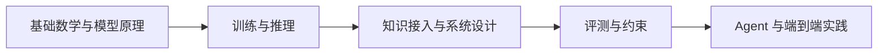
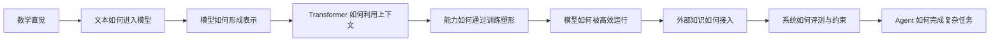
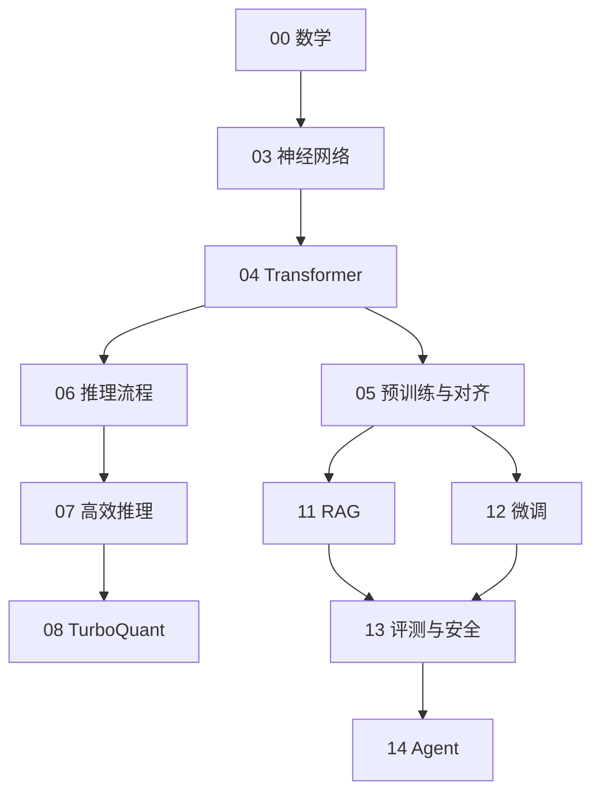

# 15 知识地图与学习路线：怎样把这套教材读成一条线

## 这章怎么读

这一章不是在讲新概念，而是在帮你把前面所有概念重新排成一条能落地的学习路径。  
如果你之前有“每章都懂一点，但连不起来”的感觉，这章就是用来修复这种断裂的。

读这章时，重点不是记住所有章节名，而是看清：

- 为什么有些章节必须先学
- 哪些主题是项目中的前后依赖
- 你当前目标最适合走哪条路线

## 先记住这件事

如果一套 AI 教材只是把概念堆在一起，读者很容易出现一种典型状态：

- 每一章都好像懂了一点
- 但脑子里没有形成一张连贯的地图
- 到做项目时，还是不知道先做什么、后做什么

这篇文档的目标，就是把前面的章节真正串起来，让你知道：

- 每一章在回答什么问题
- 为什么它必须在这个位置出现
- 学完一章之后，你在项目里具体能多做什么

## 1. 先记住这条总线

整套教材其实只围绕一条主线展开：

如果你能把这条线记住，后面的章节就不会显得零散。

## 2. 每一章到底在回答什么问题

| 章节 | 它在回答什么问题 | 学完后你应当获得什么 |
| --- | --- | --- |
| `00` 数学基础 | 看模型公式时，最基本的语言是什么 | 能看懂常见符号、loss、梯度和相似度 |
| `01` 分词 | 文本怎么变成模型能处理的 token | 能理解 token 长度、词表和上下文成本 |
| `02` 规则系统 | 为什么 AI 不只是神经网络 | 能分清规则、模型、混合系统的边界 |
| `03` 神经网络 | 为什么模型能从数据里学表示 | 能理解 embedding、反向传播和序列建模问题 |
| `04` Transformer | 为什么现代 LLM 都围绕 attention 展开 | 能看懂 Q/K/V、mask、RoPE、block 结构 |
| `05` 预训练与对齐 | 模型的通用能力和助手行为从哪来 | 能分清 pretraining、SFT、RLHF、RAG |
| `06` 推理与推理模型 | 模型运行时到底在做什么 | 能理解 decoding、prefill、test-time compute |
| `07` 高效推理 | 为什么部署时瓶颈不只在参数量 | 能理解量化、KV Cache、带宽和吞吐 |
| `08` TurboQuant | 新型 KV 压缩为什么重要 | 能理解它为何瞄准 attention 几何结构 |
| `10` 训练与优化 | 模型训练为什么成败常在配方 | 能理解 lr、batch、optimizer、正则化 |
| `11` Embedding / RAG | 模型外部知识如何接入 | 能搭起一条基本 RAG pipeline |
| `12` 微调 / LoRA / 蒸馏 | 怎样把模型变成你的模型 | 能判断何时用微调、何时用 RAG、何时用蒸馏 |
| `13` 评测与安全 | AI 系统怎么知道自己是否真的变好了 | 能建立离线/在线评测和 guardrails 意识 |
| `14` Agent | 模型怎样从“会回答”变成“会完成任务” | 能理解 agent、workflow 和 tool use 的系统区别 |

## 3. 为什么顺序不能乱

AI 知识点之间不是平铺关系，而是依赖关系。

### 3.1 为什么要先学数学，再学 Transformer

因为如果你连：

- 向量
- 点积
- softmax
- 梯度

都没有直觉，那么 attention 公式只会变成符号堆积。

### 3.2 为什么 Transformer 要先于 RAG 和 Agent

因为如果你不知道模型怎么读取上下文、怎么生成 token，就很难判断：

- RAG 是在补什么能力
- Agent 是在模型外面增加了什么系统层

### 3.3 为什么评测要放在应用章节里

因为评测真正发力的地方，往往不在“理解模型定义”时，而在你开始做系统时。没有评测，RAG、微调、Agent 都很容易变成拍脑袋调参。

## 4. 三条推荐阅读路线

## 4.1 基础薄弱但想真正学懂

推荐顺序：

`00 -> 03 -> 04 -> 05 -> 06 -> 11 -> 13`

这条路线先保证你能看懂主干，再接项目应用。

## 4.2 想尽快做企业 AI 应用

推荐顺序：

`00 -> 04 -> 05 -> 11 -> 13 -> 14 -> 12`

这条路线优先让你搭系统和评估系统。

## 4.3 想做本地部署和性能优化

推荐顺序：

`00 -> 03 -> 04 -> 06 -> 07 -> 08`

这条路线更偏推理栈和部署成本。

## 5. 怎样读每一章，才不会越读越散

建议每读一章，都强迫自己回答四个问题：

1. 这个技术在解决什么旧问题
2. 它真正的成本花在哪里
3. 它在完整 AI 系统里的位置是什么
4. 如果做项目，我会在哪一步用到它

这四个问题会让你从“记概念”切换到“建立结构”。

## 6. 一张更实用的章节依赖图

从这张图你可以看出：

- `04` 是主干节点
- `11`、`12`、`14` 是应用系统分支
- `13` 是所有分支最后都必须汇合的“质量控制层”

## 7. 怎么判断自己是不是学懂了

你不用一上来就会推导所有公式，但至少可以用下面的方法自测：

### 7.1 对 `04 Transformer`

如果你能用自己的话解释：

- Q/K/V 分别干什么
- 为什么要 causal mask
- KV Cache 为什么能提速

那就算真的入门了。

### 7.2 对 `11 RAG`

如果你能解释：

- 为什么要 chunking
- 为什么召回后还要 rerank
- 为什么 RAG 不等于微调

那就算真正理解了它在系统里的角色。

### 7.3 对 `13 评测`

如果你能解释：

- 为什么离线指标和线上体验可能不一致
- 为什么“感觉效果更好”不等于真的更好

那你已经比很多只会调 prompt 的人更接近工程实践了。

## 8. 学以致用的最小实践路径

如果你不想只读不做，可以沿着下面这条“最小实践线”往前走：

1. 学完 `00` 后，手算一次 softmax 和 cross entropy
2. 学完 `04` 后，画出一张 Transformer block 的数据流图
3. 学完 `11` 后，用任意向量库做一个最小 RAG demo
4. 学完 `13` 后，给这个 RAG demo 配一个最小评测集
5. 学完 `14` 后，再给它加一个受控工具调用

这样你会发现，知识不是分散的，而是不断往同一个系统上叠加。

## 9. 最容易断裂的三个地方

读者最容易在下面三个地方失去连贯感：

### 9.1 从神经网络跳到 Transformer

解决方法：

- 不要死记公式，先把 attention 理解成“可微分检索”

### 9.2 从模型原理跳到 RAG / 微调 / Agent

解决方法：

- 一定要始终问“这是在补知识、补行为，还是补系统能力”

### 9.3 从概念理解跳到真实项目

解决方法：

- 每学一个主题，都找一个“我项目里哪里会用到它”的落点

## 10. 这套教材最适合怎样的学习节奏

如果你是开发者，我更推荐“慢读 + 小实践”，而不是一口气刷完所有章节。

可以按下面的节奏：

- 一周读 2 到 3 章
- 每周做一个小实验或画一张关系图
- 每读完一个大模块，就回看一次总图

这样比单纯追热点论文更容易形成自己的知识框架。

## 11. 小结

知识连贯性不是靠“内容多”获得的，而是靠“每个知识点知道自己前后连接什么”获得的。真正好的教材，不只是把概念解释清楚，更会让读者知道：

- 这个概念从哪里来
- 它解决了什么
- 它会把你带到哪里去

这也是这篇文档存在的目的。
