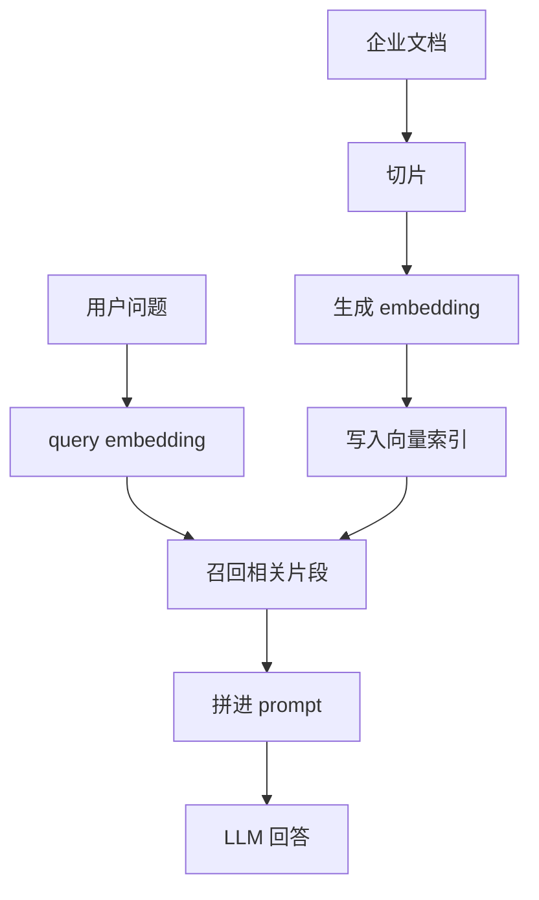

# 16 贯穿案例：从零搭一个可用的 AI 助手

如果一套教材只讲原理，不讲“这些东西最后在一个真实项目里怎么落地”，读者很容易陷入一种状态：

- 每章都看懂了
- 但不知道下一步该做什么

所以这篇文档用一个贯穿案例，把前面的章节真正串起来。

## 1. 我们要做什么

我们选一个最典型、也最适合把前面知识连起来的项目：

一个“公司内部知识助手”。

它的目标是：

- 回答员工关于制度、技术文档、流程文档的问题
- 尽量基于企业内部资料回答
- 输出稳定、可引用、可评估
- 后续还能逐步加工具和 Agent 能力

这个项目非常适合教学，因为它能串起：

- LLM 基础
- embedding / RAG
- 评测
- 微调
- Agent

## 2. 先不要急着写代码，先定义成功标准

很多 AI 项目一上来就开始接模型，但真正正确的顺序是：

1. 先定义任务
2. 再定义成功标准
3. 最后才是选技术

对这个知识助手来说，一个合理的最小成功标准可能是：

- 回答 50 个核心问题时，至少 80% 能引用到正确文档
- 平均响应时间小于 5 秒
- 对无依据问题能明确说“不确定”

这一步对应 [13-evaluation-safety-and-product-metrics.md](./13-evaluation-safety-and-product-metrics.md)。

## 3. 第一步：理解“模型本体”能做什么，不能做什么

在搭系统前，先要有正确预期：

- 预训练模型能理解和生成语言
- 但它不天然知道你公司的最新制度
- 它会补全，也会幻觉

这一步对应：

- [03-neural-networks.md](./03-neural-networks.md)
- [04-transformer.md](./04-transformer.md)
- [05-pretraining-and-alignment.md](./05-pretraining-and-alignment.md)

如果你连这一步都没想清楚，很容易把“知识缺失”误判成“模型太笨”。

## 4. 第二步：决定是先做 RAG，还是先做微调

对于“企业内部知识助手”这种问题，第一反应通常不该是微调，而该是 RAG。

原因很简单：

- 核心问题是知识不在模型参数里
- 企业文档会变
- 需要可引用依据

这一步对应 [11-embeddings-rag-and-vector-search.md](./11-embeddings-rag-and-vector-search.md)。

一个很实用的判断是：

- 缺知识，用 RAG
- 缺行为一致性，再考虑微调

## 5. 第三步：搭一个最小 RAG baseline

最小版本只需要四步：

1. 收集企业文档
2. 做 chunking
3. 用 embedding 模型编码并建索引
4. 检索结果拼进 prompt 交给 LLM 生成

这就是你第一个真正能跑的系统。

## 6. 第四步：不要急着优化，先把 baseline 评测起来

最小评测集可以这样建：

- 挑 30 到 50 个真实问题
- 每个问题准备参考答案或参考文档
- 标记“这题必须引用依据”还是“允许开放回答”

评测时至少看：

- 有没有召回正确片段
- 最终回答是否引用到了正确依据
- 模型有没有编造

这一步直接对应 [13-evaluation-safety-and-product-metrics.md](./13-evaluation-safety-and-product-metrics.md)。

## 7. 第五步：根据问题类型决定下一步优化方向

### 7.1 如果主要问题是“召回不到”

优先看：

- chunking
- embedding 模型
- query rewriting
- rerank

### 7.2 如果主要问题是“召回到了但回答风格不稳定”

优先看：

- prompt
- system instruction
- output schema
- 必要时小规模微调

### 7.3 如果主要问题是“太慢或太贵”

优先看：

- 模型大小
- 推理栈
- KV Cache 和量化
- 是否需要更小模型或蒸馏

这说明同一个项目，最终会自然把你带到不同章节。

## 8. 第六步：什么时候引入微调

如果经过 prompt 和 RAG 后，系统仍然存在这些问题，就可以考虑微调：

- 输出格式长期不稳
- 风格要求很固定
- 领域表达方式很特别
- 某类任务重复率很高

这时更适合看 [12-fine-tuning-lora-and-distillation.md](./12-fine-tuning-lora-and-distillation.md)。

对多数团队来说，更现实的顺序通常是：

`Prompt -> RAG -> 评测 -> 再考虑 LoRA`

## 9. 第七步：什么时候引入 Agent

如果你的助手开始要做的事不只是“回答问题”，而是：

- 查多处系统
- 调 API
- 根据结果继续执行
- 帮用户完成一串操作

那就要引入 Agent 能力。

例如：

- 查文档后顺便帮用户提工单
- 拉数据库记录后生成周报
- 读取代码库后自动生成修复建议

这时就该读 [14-agents-and-tool-use-systems.md](./14-agents-and-tool-use-systems.md)。

## 10. 第八步：什么时候你会真正关心推理优化

很多初学者一开始就冲着量化和 KV Cache 去，但在项目实践里，通常是当下面问题出现后你才会真正关心：

- 用户变多了
- 文档变长了
- 成本太高了
- 响应时间不能接受了

这时你才自然会需要：

- [06-inference-and-reasoning-models.md](./06-inference-and-reasoning-models.md)
- [07-efficient-inference-quantization-and-kv-cache.md](./07-efficient-inference-quantization-and-kv-cache.md)
- [08-turboquant.md](./08-turboquant.md)

也就是说，部署优化往往不是起点，而是项目做起来后的必经阶段。

## 11. 这套教材在这个项目里的对应关系

| 章节 | 在这个项目里解决什么问题 |
| --- | --- |
| `00` 数学 | 看懂 embedding 相似度、loss、softmax、梯度 |
| `01` 分词 | 理解 token 长度与上下文预算 |
| `03` 神经网络 | 理解模型为什么能学表示 |
| `04` Transformer | 理解模型如何读取上下文与生成回答 |
| `05` 预训练与对齐 | 理解模型的通用能力和行为边界 |
| `06` 推理 | 理解服务运行过程与 sampling |
| `07` 高效推理 | 理解延迟、吞吐和显存问题 |
| `08` TurboQuant | 理解更先进的 KV 压缩思路 |
| `11` RAG | 构建企业知识接入主链路 |
| `12` 微调 | 稳定行为和领域风格 |
| `13` 评测 | 验证系统是否真的变好 |
| `14` Agent | 从问答走向任务执行 |

## 12. 一个适合读者的四阶段实践计划

### 阶段一：先做出一个能用的问答 demo

目标：

- 能回答基于企业文档的问题
- 能给出引用片段

要读的章节：

- `00`
- `04`
- `11`
- `13`

### 阶段二：把它从 demo 变成系统

目标：

- 加评测
- 加 guardrails
- 管理延迟和成本

要读的章节：

- `06`
- `07`
- `13`

### 阶段三：让它更像“你的助手”

目标：

- 风格稳定
- 输出更符合你的业务流程

要读的章节：

- `05`
- `12`

### 阶段四：让它真正会做事

目标：

- 会调工具
- 会跨步骤完成任务

要读的章节：

- `14`

## 13. 你现在就可以做的最小练习

如果你想把“读懂”变成“用起来”，我建议做这三个最小练习：

1. 做一个 20 个问题的小型企业 FAQ RAG demo
2. 给它设计一个最小评测表，手工记录正确率和幻觉样例
3. 再给它加一个只读工具，例如“查询工单状态”

当这三个练习跑起来后，你会发现前面的章节不再是理论碎片，而是一条完整的系统搭建路径。

## 14. 最后要建立的实践直觉

真正的 AI 项目通常不是：

- 先选最强模型
- 再把所有热点技术都加上去

而更像：

- 先定义任务
- 先做 baseline
- 先评测
- 再顺着瓶颈选技术

这也是为什么一套好教材，不该只告诉你“某个技术是什么”，还要告诉你“它在项目里什么时候该出现”。

## 15. 小结

知识真正连起来的那一刻，不是在你把所有章节都读完的时候，而是在你发现：

- RAG 解决的是知识接入
- 微调解决的是行为塑形
- 评测解决的是可控迭代
- Agent 解决的是任务执行
- 推理优化解决的是成本和规模

当你能用这种方式看一个具体项目时，这套教材就真的开始发挥作用了。
