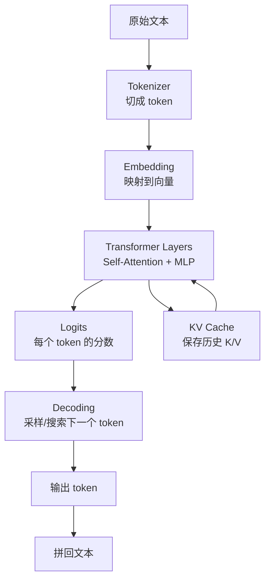

# AI 与大模型技术学习手册

这套文档现在按“零基础也能跟上”的思路做了统一整理：每章都会尽量先讲问题场景、再给直觉图、再讲核心概念和工程实现，减少一上来就陷入抽象定义或公式堆叠的阅读负担。

这套文档面向已经有工程背景、但希望系统理解 AI 与大模型技术演进的开发者。内容按“数学基础 -> 模型原理 -> 训练与对齐 -> 推理与优化 -> 应用系统”的顺序组织，尽量把概念、公式、系统设计和实际项目里的取舍放在一起讲清楚。

## 新大纲

### A. 数学与基础底座

1. [00-ai-math-foundations.md](./00-ai-math-foundations.md)
   面向数学基础不强的读者，解释做 AI 必须会用到的线性代数、概率、微积分和优化直觉。
2. [01-tokenization.md](./01-tokenization.md)
   从文本切分到子词建模，解释为什么模型世界里的一切都要先变成 token。
3. [02-rule-engines-and-symbolic-systems.md](./02-rule-engines-and-symbolic-systems.md)
   解释规则引擎、词典、模板、知识图谱这类“符号方法”为什么有效，以及为什么它们后来让位于神经网络。
4. [03-neural-networks.md](./03-neural-networks.md)
   从感知机、反向传播、Embedding、RNN/LSTM 讲到“为什么深度学习能够替代手工特征”。
5. [04-transformer.md](./04-transformer.md)
   详细解释 Transformer block、Q/K/V、自注意力、位置编码、残差连接和训练目标。

### B. 能力形成与训练方法

6. [05-pretraining-and-alignment.md](./05-pretraining-and-alignment.md)
   解释大模型为什么能“学会世界知识”，以及预训练、指令微调、偏好对齐和工具使用之间的关系。
7. [10-training-optimization-and-regularization.md](./10-training-optimization-and-regularization.md)
   解释训练时真正控制模型成败的因素：loss、batch、optimizer、learning rate、正则化、并行训练和调参。
8. [12-fine-tuning-lora-and-distillation.md](./12-fine-tuning-lora-and-distillation.md)
   解释什么时候该微调、怎么做参数高效微调、LoRA/QLoRA 的原理，以及蒸馏的工程价值。

### C. 推理与系统优化

9. [06-inference-and-reasoning-models.md](./06-inference-and-reasoning-models.md)
   解释模型推理流程、采样策略、测试时算力，以及“推理模型”和普通聊天模型的差别。
10. [07-efficient-inference-quantization-and-kv-cache.md](./07-efficient-inference-quantization-and-kv-cache.md)
   解释大模型真正上线时的成本瓶颈，重点讲量化、KV Cache、长上下文和推理优化。
11. [08-turboquant.md](./08-turboquant.md)
   解释 TurboQuant 的技术背景、核心思想、关键模块和适用边界。

### D. 应用系统与产品化

12. [11-embeddings-rag-and-vector-search.md](./11-embeddings-rag-and-vector-search.md)
   解释 embedding、向量检索、rerank、RAG pipeline，以及什么时候该用 RAG 而不是微调。
13. [13-evaluation-safety-and-product-metrics.md](./13-evaluation-safety-and-product-metrics.md)
   解释 AI 系统为什么一定要做评测、怎么设计指标、如何处理幻觉、安全、成本和用户体验。
14. [14-agents-and-tool-use-systems.md](./14-agents-and-tool-use-systems.md)
   解释 Agent、tool use、workflow orchestration、状态管理、权限和可观测性。

### E. 连贯学习与实践桥接

15. [15-knowledge-map-and-study-roadmap.md](./15-knowledge-map-and-study-roadmap.md)
   把整套文档串成一张知识地图，解释每章之间的依赖关系、推荐阅读顺序和最小实践路径。
16. [16-end-to-end-practice-building-an-ai-assistant.md](./16-end-to-end-practice-building-an-ai-assistant.md)
   用一个完整的 AI 项目把前面的知识点串起来，帮助读者真正学以致用。

### F. 附录

17. [09-glossary-and-reading-list.md](./09-glossary-and-reading-list.md)
   汇总术语、缩写和推荐阅读，方便查漏补缺。

## 原始学习路线

如果你只想先抓住大模型主线，仍然可以按：

`00 -> 01 -> 03 -> 04 -> 05 -> 06 -> 07 -> 08 -> 11 -> 13 -> 14`

这个顺序来读。

## 技术演进总图

```mermaid
flowchart LR
  A["规则 / 词典 / 模板"] --> B["统计学习\nn-gram / HMM / CRF"]
  B --> C["神经网络\nEmbedding / MLP / RNN"]
  C --> D["Attention"]
  D --> E["Transformer\n(2017-06-12)"]
  E --> F["大规模预训练\nGPT / BERT / T5 / Llama"]
  F --> G["指令微调与对齐\nSFT / RLHF / DPO"]
  G --> H["推理模型\nReasoning + Tool Use"]
  H --> I["高效推理\n量化 / KV Cache / SpecDec"]
  I --> J["TurboQuant\nKV Cache 极低比特压缩"]
```

## 一张图理解“模型栈”

## 怎么读这套文档

- 如果你数学基础比较薄弱，先看 `00`，再回来看 `03`、`04` 会轻松很多。
- 如果你偏系统设计，建议从 `04`、`06`、`07`、`08`、`14` 开始。
- 如果你偏算法原理，建议按 `00 -> 08` 顺序阅读。
- 如果你正在做企业 AI 应用，重点看 `11`、`13`、`14`。
- 如果你正在做本地模型部署，重点看 `06`、`07`、`08`。

## 阅读时建议抓住的四条主线

- 表示是怎么学出来的：`token -> embedding -> hidden states`
- 上下文是怎么被利用的：`attention -> causal mask -> KV cache`
- 能力是怎么形成的：`pretraining -> instruction tuning -> alignment`
- 成本是怎么被压下来的：`quantization -> efficient kernels -> cache compression`

## 对 AI 从业者同样重要、但常被忽略的主题

除了模型结构本身，下面这些主题对做 AI 工作同样关键：

- 数学基础：你不需要成为数学家，但要看得懂梯度、相似度、概率和损失函数。
- 训练调参与优化：很多模型成败来自训练配方，而不是架构名字。
- Embedding / RAG：企业知识接入和搜索增强几乎绕不开它。
- 微调与蒸馏：决定你是“用模型”，还是“把模型变成自己的模型”。
- 评测与产品指标：没有评测，AI 系统基本无法稳定迭代。
- Agent 与工具系统：这是今天很多复杂 AI 产品的主要组织方式。

## 这次升级后的写法

为了更接近“硬核技术博客/教材”的阅读体验，每一章会尽量同时覆盖四层内容：

- 概念层：这个技术到底解决什么问题
- 数学层：核心公式、变量关系和为什么这样设计
- 工程层：真实系统里如何实现、瓶颈在哪里
- 边界层：它在哪些场景表现好，哪些地方容易出问题

如果你是开发者，建议不要只看定义，尽量带着下面这三个问题读：

- 这项技术替代了什么旧方法，为什么替代得动
- 它的成本主要花在哪，是否受限于算力、带宽、缓存或数据
- 它与上一层和下一层技术是如何耦合的

## 这套文档的边界

本文档以语言模型和围绕它的工程生态为中心，不会深入图像、语音、多模态、强化学习理论、芯片级 kernel 细节，也不会把每一篇论文都展开成严格数学证明。目标是先建立一张正确、可落地的知识地图，再决定下一步钻哪一块更深。

## 适合你的起步顺序

如果你现在的感受是“概念很多，但数学又有点吃力”，我推荐你先按下面这条线读：

1. `00-ai-math-foundations.md`
2. `03-neural-networks.md`
3. `04-transformer.md`
4. `06-inference-and-reasoning-models.md`
5. `11-embeddings-rag-and-vector-search.md`
6. `13-evaluation-safety-and-product-metrics.md`

这条线先帮你把“看懂原理”和“做项目最常遇到的坑”打通，再回头补更深入的训练优化和推理压缩，会轻松很多。

## 如果你最在意“知识连贯性”和“学以致用”

建议把下面两篇桥接文档和主线章节穿插着读：

1. [15-knowledge-map-and-study-roadmap.md](./15-knowledge-map-and-study-roadmap.md)
2. [16-end-to-end-practice-building-an-ai-assistant.md](./16-end-to-end-practice-building-an-ai-assistant.md)

前者解决“为什么这章要在这里学、和上一章下一章什么关系”，后者解决“这些知识在真实项目里到底怎么用”。
